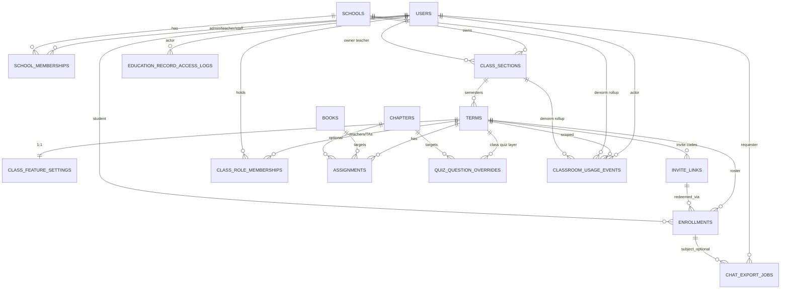
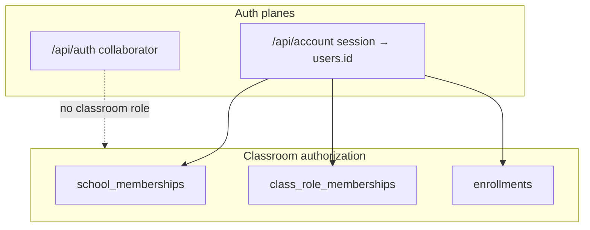

# Classroom Domain Data Model Design

| Field | Value |
| --- | --- |
| **Title** | Classroom Domain Data Model (BL-025 foundation) |
| **Author** | Engineering (draft) |
| **Date** | 2026-07-10 |
| **Status** | Draft (rev 2 — design review) |
| **Primary epic** | BL-025.1 Classroom Domain Model + Roles |
| **Related** | BL-018.6 (demo context), BL-021 (accounts), BL-042 (token attribution), BL-043 (FERPA) |

---

## Overview

Classic Chat Reader currently supports a **process-global classroom demo** (`classroom.demo.*` properties → `ClassroomContextService` → `GET /api/classroom/context`). There is no multi-tenant enrollment, roster, term, assignment, or teacher-admin storage. Reader accounts exist (`users`, `user_sessions` from BL-021), and collaborator/operator auth remains a separate operational path (`/api/auth`).

This design specifies a **durable multi-tenant classroom domain model** that:

1. Supports student rosters, instructor-as-class-admin, shareable invite links, independent class feature flags, assignments, teacher quiz question overrides, usage events (with BL-042 attribution hooks), chat-export audit logs, term-scoped history, and Teacher vs School tiers.
2. Remains **compatible** with the existing `ClassroomContextResponse` shape (additive fields only where needed).
3. Separates **classroom roles** from **collaborator/operator** auth and from raw account identity.
4. Provides **schema hooks** for FERPA-oriented soft-delete, term windows, and education-record access/export audit. Executable retention policy, purge jobs, and legal defaults live in **BL-043** (not completed by columns alone).

The model is intentionally implementable as Flyway + JPA entities first (BL-025.1 foundation PRs), then layered APIs/UI in later slices (BL-025.2–.10).

---

## Background & Motivation

### Current state

| Area | Today |
| --- | --- |
| Classroom enrollment | Demo flag only; every client sees the same class when `classroom.demo.enabled=true` |
| Feature gates | Independent booleans in `ClassroomDemoProperties.Features`; largely **FE-only** kill-switches (server does not 403 on classroom flags in demo mode) |
| Assignments | Properties list; resolved against `books`/`chapters` |
| Quiz requirement status in **context path** | `ClassroomContextService` uses `quizAttemptRepository.existsByChapterId(chapterId)` — **global**, any attempt for that chapter. Elsewhere, `quiz_attempts` **can** be queried by `user_id` / `reader_id` (V5/V6); those methods are not used for context quiz chips today |
| Identity | `users` + sessions (BL-021); `ReaderIdentityService` → authenticated `userId` or anonymous `readerId`. Account-bound `owner_key` format: `user:{userId}` |
| Chat history (server) | **Reading Buddy only**: `reading_buddy_messages` / memories keyed by `owner_key`. **Character chat and recap discussion history are localStorage-only** (no durable server table) |
| Quizzes | Global `chapter_quizzes.payload_json` per chapter. `ChapterQuizPayload.Question` fields today: `question`, `options`, `correctOptionIndex`, `citationParagraphIndex`, `citationSnippet` — **no stable `id`** |
| Multi-class / school / term | None |

### Pain points for pilot

Educator partner (college professor, 2026-07-09) requires real roster + invite link, instructor admin, usage logging, chat export, semester boundaries, dashboard drill-down, independent toggles (e.g. recap off / quiz on), and per-question quiz overrides. Pilot scale is small (a couple of college classes) but schema should not paint us into a single-class corner.

### Constraints

- **Do not** conflate classroom Teacher role with `/api/auth` collaborator sessions.
- Classroom enrollment depends on **account** identity (BL-021); anonymous readers cannot join for real.
- BL-025.6/.7/.10 are gated by BL-043 FERPA exit criteria for broad ship; schema must still land hooks early.
- Existing demo path must remain usable during migration (dual-read / `classroom.mode`).
- BL-025.5 **requires stable generated question ids** (or a redefined overlay model) before OVERRIDE/DISABLE is shippable — see KD-7 and PR-0.

---

## Goals & Non-Goals

### Goals

1. Define entities, relationships, cardinality, indexes, and uniqueness for classroom multi-tenancy.
2. Encode role memberships: Student, Teacher (class admin), optional School Admin — distinct from collaborator.
3. Support semester/term-scoped rosters with historical queryability and an implementable **term transition** procedure.
4. Invite-link lifecycle: issue, expire, revoke, regenerate, with **atomic redeem** semantics.
5. Independent per-class feature toggles matching `ClassroomFeatureStates` (+ extensible).
6. Assignments (book/chapter, due window, required quiz) and a **documented v1 policy** for assignment completion vs `quiz_attempts`.
7. Layered teacher quiz overrides (add/override individual questions), **dependent on stable question ids** in generated payloads.
8. Usage/activity event schema with classroom + term attribution and token metadata hooks for BL-042, plus write-path discipline for the reader hot path.
9. Chat export support for **server-persisted** sources + FERPA access/export audit tables; explicit inventory of what is *not* exportable.
10. Migration path from demo properties → DB-backed multi-class without breaking `GET /api/classroom/context`, including **teacher** context via role memberships.
11. **Schema hooks only** for soft-delete and term-end lifecycle (`deleted_at`, `retention_purge_after`); not a complete retention implementation.
12. Size for pilot (~2 classes, tens of students) with indexes that scale to multi-school growth.

### Non-Goals

- Full teacher dashboard UI, LMS gradebook export, or SIS/roster CSV import product design.
- Parental consent / K-12 guardian accounts (schema note only; pilot is college-age).
- Changing collaborator auth or public-mode operational security model.
- Implementing token billing/pricing (BL-042) beyond attribution fields.
- Server-enforcing every feature flag on day one (model supports it; enforcement is BL-025.3).
- Full VPAT / ADA schema (no schema impact beyond existing content accessibility).
- **Executable retention / purge policy** (legal durations, batch jobs, data-controller designation) — owned by **BL-043**.
- Server persistence of character/recap chat for export — not assumed unless a separate epic lands; BL-025.7 v1 is **narrowed** to server stores.

---

## Key Decisions

| # | Decision | Rationale |
| --- | --- | --- |
| KD-1 | **School tier is first-class in schema from day one**, but Teacher-only accounts may create classes without a school (`school_id` nullable on classes). School membership is required only for multi-teacher org admin. | Partner asked for Teacher vs School tiers; pilot may start teacher-only. Avoids a later painful “attach school” migration if we omit `schools` table. |
| KD-2 | **Term is a first-class entity**; a **ClassSection** (course offering) has many **Terms**. Rosters (`enrollments`) hang off **term**, not bare class. Term status is **manual/API-driven** (not auto from `start_date`/`end_date` in v1); calendar bounds use **DATE** (not TIMESTAMP) and are advisory. | “New semester = new roster, keep history” maps cleanly. Clock-driven status is error-prone without jobs. Semester bounds are calendar days, not instants. |
| KD-3 | **Invite link grants enrollment as Student in a specific term** (not account type, not teacher). Requires authenticated account. Codes: **128-bit URL-safe**, store **SHA-256** hash only. Redeem is a **single transaction** with row lock + atomic `use_count`. | Privilege safety + concurrency. Align hash style with session token hashing practices. |
| KD-4 | **Classroom roles are membership rows**, not columns on `users`. A user can be Teacher of one class and Student of another. | Real multi-class world; avoids mutually exclusive “account type” flags. |
| KD-5 | **Collaborator/operator auth remains orthogonal** — no FK from classroom tables to collaborator sessions. | BL-021 ADR decision 1. |
| KD-6 | **Feature flags = independent booleans on `class_feature_settings` (1:1 with term)**. Column defaults TRUE to match current code defaults. **Pilot seed recommendation** (product ops, not schema default): `recap_enabled=false` for partner pilot if they want recap off — set at term create, not by changing global column defaults. | Schema defaults = safe product defaults; pilot can set recap off explicitly (BL-025.3). |
| KD-7 | **Stable question `id` is a blocking prerequisite for OVERRIDE/DISABLE.** Payload schema gains required `id` (UUID string) on each generated question; backfill existing `payload_json`. Overlay rows use `overlay_key` + ops `ADD`/`OVERRIDE`/`DISABLE`. Regen invalidates overrides whose `source_question_id` is missing (warn teacher). | Today `ChapterQuizPayload.Question` has **no id** — without PR-0, BL-025.5 cannot ship correctly. |
| KD-8 | **Usage events are append-only** with `user_id`, optional `term_id`/`class_section_id`/`school_id` filled **server-side** from membership, event type, timing, optional token fields. | Dashboard + BL-042; never trust client for school/term denorm. |
| KD-9 | **Chat export v1** references **server-persisted** messages only (`reading_buddy_messages`, optional memories). Character/recap chat remain **non-exportable** until a persistence epic. Jobs write **audit rows**; optional artifact storage. | FERPA minimization; match reality of localStorage character chat. |
| KD-10 | **Soft-delete + retention timestamps** are **hooks**. Hard purge, legal hold, and reconciliation with **BL-021 24h account hard-delete** are BL-043 + lifecycle matrix in this doc. | Columns alone do not implement compliance. |
| KD-11 | **Single config: `classroom.mode=demo\|database\|hybrid`** (default `hybrid` in dev, `database` for pilot prod). No separate `classroom.persistence.enabled`. Dual-read: DB membership first → demo only if mode allows and **no** DB membership. | Avoid flag dualism. |
| KD-12 | **Context candidates** = ACTIVE student enrollments ∪ ACTIVE class_role_memberships on ACTIVE terms. Selection: explicit `termId` → single candidate → most recent activity timestamp with **stable id tie-break** → multi-candidate: return primary by rule and optional future list; avoid 409 on GET for FE compatibility unless FE ready. Map `role` = `TEACHER` if any teacher role on chosen term, else `STUDENT`. | Teachers are not enrollments; pure teacher must see class context. |
| KD-13 | **IDs**: UUID strings (`VARCHAR(255)`) consistent with `users.id` (`@GeneratedValue(UUID)` / VARCHAR PK). Public invite codes separate from internal ids. | Matches codebase patterns. |
| KD-14 | **No per-student feature overrides in v1 schema**. | Avoid scope creep. |
| KD-15 | **Assignment quiz COMPLETE in v1** uses **user-scoped** attempt for the chapter (**class-agnostic**): any successful attempt by that user for `chapter_id` counts. Document limitation for multi-class same-chapter. Optional `assignment_completions` deferred if gradebook needs term isolation. | Avoids schema change to `quiz_attempts` for pilot; dashboard can still use usage events for term-scoped activity. |
| KD-16 | **School admin education-record access: Deny by default** until BL-043 policy. School admin may manage structure (sections/memberships) only. | Safer pilot; matrix unambiguous for BL-025.1. |
| KD-17 | **Membership uniqueness is update-in-place**: one row per `(school_id,user_id,role)` / `(term_id,user_id,role)`; re-invite = status ACTIVE + clear `revoked_at`. | Avoids unique-constraint dead ends after REVOKED. |
| KD-18 | **Teachers are not auto-enrolled as students.** Roster is students only; teacher presence is `class_role_memberships`. Optional later: “teacher also reads as student” product feature. | Cleaner roster counts. |
| KD-19 | **Co-teachers in pilot**: teacher (owner) adds by **email** of existing account (no elevated invite link). Invite links never grant teacher. | Schema already supports multi teacher rows; grant path is API-only. |
| KD-20 | **Global product capabilities are separate from contextual classroom roles.** `account_capabilities.CREATE_CLASSROOM` bootstraps first-class creation; `class_role_memberships` continues to authorize management of a specific term. Teaching navigation is available with either the global capability or an active teacher-like membership, while creating another class requires the global capability. | A deployment property allow-list would make authorization environment-specific. A durable capability is auditable, survives deployments, and leaves room for future account-tier capabilities without pretending a user has one global classroom role everywhere. |

---

## Proposed Design

### Conceptual model



### Entity catalog

#### 1. `schools` (Institution)

Optional container for multi-teacher governance (BL-025.8).

| Column | Type | Notes |
| --- | --- | --- |
| `id` | VARCHAR(255) PK | UUID |
| `name` | VARCHAR(255) NOT NULL | Display name |
| `slug` | VARCHAR(64) NULL UNIQUE | Optional external id |
| `status` | VARCHAR(32) NOT NULL | `ACTIVE`, `SUSPENDED`, `ARCHIVED` |
| `created_at` / `updated_at` | TIMESTAMP | |
| `deleted_at` | TIMESTAMP NULL | Soft-delete; **all reads filter `deleted_at IS NULL`** |

#### 2. `school_memberships`

| Column | Type | Notes |
| --- | --- | --- |
| `id` | VARCHAR(255) PK | |
| `school_id` | FK → schools | |
| `user_id` | FK → users | |
| `role` | VARCHAR(32) NOT NULL | `SCHOOL_ADMIN`, `SCHOOL_TEACHER`, `SCHOOL_STAFF` |
| `status` | VARCHAR(32) NOT NULL | `ACTIVE`, `INVITED`, `REVOKED` |
| `created_at` / `updated_at` / `revoked_at` | TIMESTAMP | |

**Uniqueness:** `UNIQUE (school_id, user_id, role)` — **exactly one row** forever for that triple. **Re-invite / reactivate:** update `status` → `ACTIVE`, clear `revoked_at` (KD-17). Never insert a second row after revoke.

#### 3. `class_sections` (stable “course” / classroom shell)

| Column | Type | Notes |
| --- | --- | --- |
| `id` | VARCHAR(255) PK | Public `classId` in API |
| `school_id` | FK NULL | Null for pure teacher-owned |
| `owner_user_id` | FK → users NOT NULL | Primary teacher / billing contact |
| `name` | VARCHAR(255) NOT NULL | e.g. Literature 101 |
| `code` | VARCHAR(64) NULL | Optional human code lit-101 |
| `status` | VARCHAR(32) NOT NULL | `ACTIVE`, `ARCHIVED` |
| `created_at` / `updated_at` / `deleted_at` | TIMESTAMP | |

#### 4. `terms` (semester / academic window)

| Column | Type | Notes |
| --- | --- | --- |
| `id` | VARCHAR(255) PK | |
| `class_section_id` | FK → class_sections NOT NULL | |
| `name` | VARCHAR(128) NOT NULL | e.g. Fall 2026 |
| `start_date` | DATE NULL | Inclusive term start (calendar day); advisory only in v1 — does not auto-drive status |
| `end_date` | DATE NULL | Inclusive term end (calendar day); advisory only in v1 |
| `status` | VARCHAR(32) NOT NULL | `PLANNED`, `ACTIVE`, `ENDED`, `ARCHIVED` |
| `retention_purge_after` | TIMESTAMP NULL | FERPA **hook**: earliest hard-delete eligibility after end; set by transition service; **duration from BL-043** (placeholder default in ops: end + 400 days if unset for pilot) |
| `created_at` / `updated_at` / `deleted_at` | TIMESTAMP | |

**Invariant:** At most one `ACTIVE` term per `class_section_id`, enforced **transactionally** in `TermTransitionService` (SELECT FOR UPDATE on section or active-term row). Portable DBs: no partial unique in v1; Postgres partial unique may be added later as optimization only.

#### 5. `enrollments` (roster rows)

| Column | Type | Notes |
| --- | --- | --- |
| `id` | VARCHAR(255) PK | |
| `term_id` | FK → terms NOT NULL | Roster scoped to term |
| `user_id` | FK → users NOT NULL | Student account |
| `role` | VARCHAR(32) NOT NULL | Default `STUDENT` |
| `status` | VARCHAR(32) NOT NULL | `ACTIVE`, `WITHDRAWN`, `REMOVED`, `COMPLETED` |
| `joined_date` | DATE NOT NULL | Inclusive calendar day student joined the term roster (set on enroll; not a high-resolution audit instant) |
| `left_date` | DATE NULL | Inclusive calendar day status left ACTIVE (withdraw/remove/complete); set with status transitions |
| `invite_link_id` | FK → invite_links NULL | How they joined |
| `display_name_override` | VARCHAR(255) NULL | Optional roster name |
| `created_at` / `updated_at` / `deleted_at` | TIMESTAMP | Soft-delete for purge pipeline |

**Uniqueness:** `UNIQUE (term_id, user_id)`.

**Query convention:** Roster UIs and authorization “is enrolled?” use `status=ACTIVE` AND `deleted_at IS NULL`. Historical dashboard uses status ∈ (`ACTIVE`,`WITHDRAWN`,`COMPLETED`) without requiring active term.

#### 6. `class_role_memberships` (teachers / co-teachers on a term)

| Column | Type | Notes |
| --- | --- | --- |
| `id` | VARCHAR(255) PK | |
| `term_id` | FK → terms NOT NULL | |
| `user_id` | FK → users NOT NULL | |
| `role` | VARCHAR(32) NOT NULL | `TEACHER`, `CO_TEACHER`, `TA` (v1: `TEACHER`) |
| `status` | VARCHAR(32) NOT NULL | `ACTIVE`, `REVOKED` |
| `created_at` / `updated_at` / `revoked_at` | TIMESTAMP | |

**Uniqueness:** `UNIQUE (term_id, user_id, role)` — update-in-place reactivation (KD-17).

**Bootstrap:** On class create, insert membership for `owner_user_id` on the first term.

#### 7. `invite_links`

| Column | Type | Notes |
| --- | --- | --- |
| `id` | VARCHAR(255) PK | |
| `term_id` | FK → terms NOT NULL | Redeem enrolls the student into this term’s roster |
| `code_hash` | VARCHAR(120) NOT NULL UNIQUE | SHA-256 hex (or hex of raw) of secret code |
| `code_hint` | VARCHAR(12) NULL | Last 4 chars for teacher UI |
| `label` | VARCHAR(128) NULL | e.g. “Fall share link” |
| `max_uses` | INT NULL | Null = unlimited; pilot may leave null |
| `use_count` | INT NOT NULL DEFAULT 0 | |
| `expires_at` | TIMESTAMP NULL | |
| `revoked_at` | TIMESTAMP NULL | |
| `created_by_user_id` | FK → users | |
| `created_at` / `updated_at` | TIMESTAMP | |
| `replaced_by_link_id` | VARCHAR(255) NULL | Self-FK soft reference to successor |

**Code generation:** 22-char URL-safe Base64 of **16 random bytes** (128-bit entropy). Return raw code **once** at issuance; persist only `code_hash` = SHA-256(UTF-8 code) hex, same family of practice as session token hashes (never store raw).

**Redeem (transactional procedure):**

1. Require authenticated account session (`userId`).
2. Hash presented code → lookup by `code_hash`.
3. `SELECT … FOR UPDATE` on `invite_links` row.
4. Fail if missing, `revoked_at` set, `expires_at` past, or term not `ACTIVE`, or (`max_uses` not null AND `use_count >= max_uses`).
5. If enrollment exists for `(term_id, user_id)`:
   - If `ACTIVE`: **idempotent success** (do not increment `use_count` again).
   - If `WITHDRAWN`/`REMOVED`: reactivate if policy allows (v1: teacher must re-add OR allow reactivate on redeem — **v1 allow reactivate** to ACTIVE, set `invite_link_id`, increment use_count once per successful status change).
6. Else insert enrollment `STUDENT`/`ACTIVE`, set `invite_link_id`, increment `use_count` by 1 with check constraint in app (`use_count + 1 <= max_uses` if max set).
7. Commit.

**Regenerate:** create new link; set old `revoked_at=now()`, `replaced_by_link_id=new.id`.

**Rate limits:** Per-IP and per-user redeem attempts, aligned with BL-028 account auth patterns (`429` + `Retry-After`).

**Failure modes (API sketch):** `INVALID_CODE`, `EXPIRED`, `REVOKED`, `TERM_NOT_ACTIVE`, `MAX_USES`, `UNAUTHENTICATED`, `RATE_LIMITED`.

**FK:** `enrollments.invite_link_id` → `invite_links(id)` ON DELETE SET NULL (or RESTRICT). Create invite_links before enrollments FK in migration order.

#### 8. `class_feature_settings` (independent booleans)

1:1 with term (KD-6).

| Column | Type | Notes |
| --- | --- | --- |
| `term_id` | VARCHAR(255) PK/FK | |
| `quiz_enabled` | BOOLEAN NOT NULL DEFAULT TRUE | |
| `recap_enabled` | BOOLEAN NOT NULL DEFAULT TRUE | Pilot may set FALSE at create |
| `tts_enabled` | BOOLEAN NOT NULL DEFAULT TRUE | |
| `illustration_enabled` | BOOLEAN NOT NULL DEFAULT TRUE | |
| `character_enabled` | BOOLEAN NOT NULL DEFAULT TRUE | |
| `chat_enabled` | BOOLEAN NOT NULL DEFAULT TRUE | |
| `speed_reading_enabled` | BOOLEAN NOT NULL DEFAULT TRUE | |
| `reading_buddy_enabled` | BOOLEAN NOT NULL DEFAULT TRUE | Align with demo + FE |
| `updated_at` | TIMESTAMP NOT NULL | |
| `updated_by_user_id` | FK NULL | |

Maps 1:1 to `ClassroomContextResponse.ClassroomFeatureStates`.

#### 9. `assignments`

| Column | Type | Notes |
| --- | --- | --- |
| `id` | VARCHAR(255) PK | `assignmentId` in API |
| `term_id` | FK → terms NOT NULL | |
| `title` | VARCHAR(255) NOT NULL | |
| `book_id` | VARCHAR(255) NOT NULL | Prefer FK → books |
| `chapter_id` | VARCHAR(255) NULL | FK → chapters |
| `chapter_index` | INT NULL | Fallback resolution like demo |
| `due_date` | DATE NULL | Inclusive calendar due day (end-of-local-day semantics in UI/API if needed) |
| `available_from_date` | DATE NULL | Optional inclusive open day for the assignment |
| `quiz_required` | BOOLEAN NOT NULL DEFAULT FALSE | |
| `sort_order` | INT NOT NULL DEFAULT 0 | |
| `status` | VARCHAR(32) NOT NULL | `DRAFT`, `PUBLISHED`, `ARCHIVED` |
| `created_by_user_id` | FK | |
| `created_at` / `updated_at` / `deleted_at` | TIMESTAMP | |

**Quiz status for student context (service, not stored):** same enum as today — `NOT_REQUIRED` / `PENDING` / `COMPLETE` / `UNKNOWN`.

**v1 COMPLETE definition (KD-15):** for authenticated user, `quiz_attempts` where `user_id = :userId` AND `chapter_id = :chapterId` exists (add repository method `existsByChapterIdAndUserId`). **Class-agnostic:** does not require `term_id` on attempts. Documented limitation: if the same chapter is assigned in two concurrent classes, completing once completes both quiz chips. Dashboard “activity in this term” should prefer `classroom_usage_events` / term-filtered views, not rely solely on attempts for isolation.

**Deferred:** `assignment_completions(term_id, assignment_id, user_id, completed_at, source)` if gradebook requires term-isolated completion.

#### 10. Quiz payload ids (prerequisite) + `quiz_question_overrides`

##### 10a. Generated question stable ids (blocking for OVERRIDE/DISABLE)

**Current code:** `ChapterQuizPayload.Question` has no `id` field.

**Required change (PR-0 / BL-025.5 prerequisite):**

```java
public record Question(
    String id,  // NEW: non-null UUID string after generation/normalize
    String question,
    List<String> options,
    Integer correctOptionIndex,
    Integer citationParagraphIndex,
    String citationSnippet
) {}
```

- Generation path assigns UUID per question before persist.
- **Backfill:** on read of old payloads without ids, `ChapterQuizService` normalizes by assigning deterministic ids if possible, else new UUIDs, and re-persists `payload_json` when status READY (or lazy-migrate on first read). Prefer: one-shot migrator that parses all READY quizzes and rewrites payloads with ids + bumps `updated_at` without changing `prompt_version` unless needed.
- Assembler tests use real samples from `ChapterQuizService` output shape.

**Matching key for overrides:** `source_question_id` = question `id` string (never array index, never question text).

##### 10b. `quiz_question_overrides`

| Column | Type | Notes |
| --- | --- | --- |
| `id` | VARCHAR(255) PK | |
| `term_id` | FK → terms NOT NULL | |
| `book_id` | VARCHAR(255) NOT NULL | |
| `chapter_id` | VARCHAR(255) NOT NULL | |
| `operation` | VARCHAR(16) NOT NULL | `ADD`, `OVERRIDE`, `DISABLE` |
| `source_question_id` | VARCHAR(128) NULL | Required for OVERRIDE/DISABLE; null for ADD |
| `overlay_key` | VARCHAR(160) NOT NULL | Portable uniqueness key (see below) |
| `sort_order` | INT NOT NULL DEFAULT 0 | |
| `question_json` | TEXT NULL | Full question object for ADD/OVERRIDE (must include `id` for ADD) |
| `status` | VARCHAR(32) NOT NULL | `ACTIVE`, `ARCHIVED` |
| `base_prompt_version` | VARCHAR(100) NULL | Optional snapshot of generated quiz `prompt_version` at authoring time (warn if drifted) |
| `created_by_user_id` | FK | |
| `created_at` / `updated_at` / `deleted_at` | TIMESTAMP | |
| `notes` | VARCHAR(500) NULL | Teacher private note |

**Portable uniqueness:**

- `overlay_key` = for OVERRIDE/DISABLE: `source_question_id`; for ADD: row `id` (self).
- DB: `UNIQUE (term_id, chapter_id, overlay_key)`.
- **Active-only semantics in app:** when archiving, either (a) change `overlay_key` to `archived:{id}` and set status ARCHIVED, or (b) set status ARCHIVED and allow re-insert of new ACTIVE with same source by first archiving old (update-in-place preferred: set ARCHIVED then insert new ACTIVE with same key only after archive changes key). **v1 rule: update-in-place** — one row per overlay_key; status ACTIVE|ARCHIVED; ARCHIVED rows ignored by merger; reactivate by updating status/content.

**Conflict rules (ACTIVE rows only for merge):**

1. At most one ACTIVE non-ADD op per `source_question_id` (enforced by unique overlay_key).
2. **Cannot** have both DISABLE and OVERRIDE for same source simultaneously (same key) — last write wins via update-in-place of operation + payload.
3. Merge order on ACTIVE rows only: DISABLE → OVERRIDE → ADD (sort_order).
4. Pure function: `effective = merge(generatedPayload, activeOverrides)`; ARCHIVED/`deleted_at` excluded.
5. If generated quiz regenerates and `source_question_id` missing → that OVERRIDE/DISABLE is skipped; surface `staleOverrideIds` in teacher API; ADDs always append.
6. Concurrent teacher edits: last-write-wins on row `updated_at`; optional ETag later.

#### 11. `classroom_usage_events`

Append-only education-record-adjacent telemetry.

| Column | Type | Notes |
| --- | --- | --- |
| `id` | VARCHAR(255) PK | |
| `user_id` | FK → users NOT NULL | Actor (student); from session, not client claim |
| `term_id` | FK NULL | Server-derived from membership |
| `class_section_id` | FK NULL | Denormalized for school rollup |
| `school_id` | FK NULL | Denormalized for BL-042 school cost |
| `event_type` | VARCHAR(64) NOT NULL | See enum below |
| `book_id` / `chapter_id` / `paragraph_index` | optional | |
| `assignment_id` | VARCHAR(255) NULL | |
| `duration_ms` | BIGINT NULL | Server may clamp **`READING_HEARTBEAT` only** (`[0, 120_000]`). **BL-042.5 voice:** Call Character / realtime duration (not minutes); do **not** apply the heartbeat clamp — sessions can run longer. |
| `progress_percent` | INT NULL | 0–100 |
| `session_id` | VARCHAR(255) NULL | Client reading session |
| `idempotency_key` | VARCHAR(120) NULL | Optional client key; UNIQUE when not null for dedupe |
| `feature` | VARCHAR(64) NULL | `CHAT`, `VOICE`, `QUIZ_GEN`, `RECAP`, `TTS`, `ILLUSTRATION`, `READING_BUDDY`, … (`VOICE` = Call Character / realtime; not book `TTS`. No Java enum — VARCHAR.) |
| `provider` / `model_name` | optional | Token events. **BL-042.5:** `model_name`. |
| `input_tokens` / `output_tokens` | INT NULL | BL-042. **BL-042.5 chat:** persist here; cached tokens in `metadata_json` (no dedicated column). |
| `estimated_cost_micros` | BIGINT NULL | Optional. **BL-042.5:** current xAI list rates as micros (not a USD column). |
| `metadata_json` | TEXT NULL | **Non-PII only**; size-capped (e.g. 2 KiB). **BL-042.5:** `billed_via` (`oauth` \| `api_key`) and cached tokens. Never prompt/completion text. |
| `occurred_at` / `created_at` | TIMESTAMP | |
| `deleted_at` | TIMESTAMP NULL | Soft purge |

**Event types (v1):** `READING_HEARTBEAT`, `CHAPTER_OPEN`, `CHAPTER_COMPLETE`, `BOOK_PROGRESS`, `QUIZ_ATTEMPT`, `ASSIGNMENT_VIEW`, `AI_TOKEN_USAGE`.

**BL-042.5 this-term cut** (reuse this table; no second ledger, no new column names): `event_type` = `AI_TOKEN_USAGE`; `feature` = `CHAT` (character chat) or `VOICE` (Call Character / realtime). Cost on `estimated_cost_micros`; voice duration on `duration_ms` (do **not** apply the `READING_HEARTBEAT` `[0, 120_000]` clamp — Call Character sessions can run longer); `billed_via` + cached tokens in `metadata_json`. Full acceptance in [Notion Tasks](https://app.notion.com/p/3d0064dd143280c1a8d4d070d92fbf3f) → `BL-042.5`.

**Write path (PR-10 acceptance):**

- Prefer **async** ingest (queue or `@Async`) off the critical path of page turns; sync OK for low pilot volume if rate-limited.
- **Heartbeat max frequency:** 1 per `(user_id, session_id, book_id)` per **60s** (server drop/coalesce extras).
- `duration_ms` on **`READING_HEARTBEAT` only:** client may send elapsed since last heartbeat; server clamps to `[0, 120_000]` per event. This clamp does **not** apply to `AI_TOKEN_USAGE` / `VOICE` (Call Character) — persist the real session duration.
- **Never trust** client `school_id` / `term_id` / `class_section_id` — derive from active membership for actor.
- Token events may also be written from server-side LLM callers (authoritative) to avoid relying solely on client.
- Indexes: `(term_id, user_id, occurred_at)`, `(term_id, event_type, occurred_at)`, `(school_id, occurred_at)`, `(user_id, occurred_at)`, unique partial-style: unique on `idempotency_key` where not null (portable: unique on column allowing multiple NULLs on Postgres/H2/MariaDB).

#### 12. `education_record_access_logs`

| Column | Type | Notes |
| --- | --- | --- |
| `id` | VARCHAR(255) PK | |
| `actor_user_id` | FK NOT NULL | |
| `subject_user_id` | FK NOT NULL | |
| `term_id` | FK NULL | |
| `access_type` | VARCHAR(64) NOT NULL | `VIEW_DASHBOARD`, `VIEW_ROSTER`, `VIEW_USAGE`, `EXPORT_CHAT`, `EXPORT_USAGE`, … |
| `resource_type` / `resource_id` | optional | |
| `ip_hash` / `user_agent_hash` | optional | No raw IP storage in v1 |
| `occurred_at` | TIMESTAMP NOT NULL | |
| `retain_until` | TIMESTAMP NULL | **Audit retention hook** (often longer than education content; set by BL-043 policy) |

Audit rows are **not** soft-deleted with student content by default; purge only after `retain_until` per BL-043.

#### 13. `chat_export_jobs` + export inventory

| Column | Type | Notes |
| --- | --- | --- |
| `id` | VARCHAR(255) PK | |
| `requester_user_id` / `subject_user_id` | FK NOT NULL | |
| `term_id` | FK NULL | Scope for authorization + filter window |
| `format` | VARCHAR(16) NOT NULL | `JSON`, `TXT`, `CSV` (PDF later) |
| `status` | VARCHAR(32) NOT NULL | `PENDING`, `READY`, `FAILED`, `EXPIRED` |
| `chat_sources` | VARCHAR(128) NOT NULL | v1 allowlist: `READING_BUDDY` only |
| `filter_book_id` | VARCHAR(255) NULL | |
| `filter_from` / `filter_to` | TIMESTAMP NULL | Approximate term window if messages lack `term_id` |
| `artifact_storage_key` | VARCHAR(512) NULL | |
| `error_message` | VARCHAR(500) NULL | |
| `created_at` / `completed_at` / `expires_at` / `deleted_at` | TIMESTAMP | |

##### Exportable inventory (authoritative)

| Source | Storage today | Exportable in BL-025.7 v1? |
| --- | --- | --- |
| Reading Buddy messages | `reading_buddy_messages` (`owner_key`) | **Yes** |
| Reading Buddy memories | `reading_buddy_memories` | Optional include flag |
| Character chat | **localStorage only** | **No** — document limitation; separate persistence epic if required |
| Recap discussion chat | **localStorage only** (same pattern) | **No** |

**owner_key resolution:** for account users, `ReaderIdentityService` uses `user:{userId}` — export queries `owner_key = 'user:' || subject_user_id`.

**Term filter:** messages have no `term_id`; approximate with `created_at` spanning term `start_date`/`end_date` (inclusive calendar bounds, interpreted in server timezone or as UTC day bounds) or job `filter_from`/`filter_to`, plus optional `book_id`. Cannot reconstruct deleted local chats.

**Authorization:** requester is subject OR has ACTIVE `TEACHER`/`CO_TEACHER` on term where subject has (or had) enrollment. School admin: **Deny** (KD-16) until BL-043. Always write access log on export.

#### 14. Role model summary

| Role surface | Storage | Capabilities (data-access intent) |
| --- | --- | --- |
| **Account user** | `users` | Auth only |
| **Student** | `enrollments.role=STUDENT` | Own progress; self export; see own class context |
| **Teacher (class admin)** | `class_role_memberships` | Roster, features, assignments, overrides, student drill-down/export within term |
| **School admin** | `school_memberships.role=SCHOOL_ADMIN` | Structure R/W under school; **education records Deny by default** (KD-16) |
| **Collaborator/operator** | `/api/auth` (not this schema) | Ops endpoints; **Deny** classroom education records by default |



---

## Term transition (rollover) — implementable procedure

**Service:** `TermTransitionService` (BL-025.9 / PR-13). All steps in **one DB transaction** unless noted.

### Invariants

- After success: exactly one `ACTIVE` term for the section (or zero if archiving all).
- Old term status becomes `ENDED` (or `ARCHIVED` if hard-close).
- Child history rows for old term **remain** (enrollments, assignments, overrides, invite_links, usage events).

### Inputs

- `class_section_id`, actor `userId` (must be ACTIVE teacher on current ACTIVE term or section owner), new term `name`, optional date bounds, optional feature seed, flags: `copyAssignments` (default false), `copyOverrides` (default false), `copyTeachers` (default true).

### Steps

1. Lock section / load current `ACTIVE` term `T_old` (if any). Fail if concurrent second ACTIVE (defensive).
2. If `T_old` present:
   - Set `T_old.status = ENDED`.
   - Set `T_old.retention_purge_after = (coalesce(T_old.end_date, CURRENT_DATE) + retention_duration)` as a TIMESTAMP at start of that calendar day (or end of day — pick one in implementation and document), where **retention_duration is BL-043 config** (ops placeholder: 400 days).
   - Set ACTIVE enrollments on `T_old` → `COMPLETED` (or leave ACTIVE until purge — **v1: set COMPLETED + `left_date=CURRENT_DATE`** for clean roster semantics).
   - **Invite links on `T_old`:** set `revoked_at=now()` (no new students on ended term).
   - Assignments on `T_old`: leave as historical; do not delete. Status unchanged (PUBLISHED remains for history UI).
   - Quiz overrides on `T_old`: leave historical; not used for student merge once term not ACTIVE.
3. Insert `T_new` with `status=ACTIVE`.
4. Insert `class_feature_settings` for `T_new`: copy from `T_old` settings if present, else column defaults (TRUE…).
5. **Teachers:** if `copyTeachers`, for each ACTIVE `class_role_memberships` on `T_old`, insert ACTIVE row on `T_new` (same user/role). Always ensure `owner_user_id` has TEACHER on `T_new`.
6. **Invite links:** create **one new** default invite link for `T_new`; do not reuse old codes.
7. **Assignments:** if `copyAssignments`, deep-copy PUBLISHED/DRAFT as DRAFT on `T_new` with new ids; else empty.
8. **Overrides:** if `copyOverrides`, copy ACTIVE overrides to `T_new` with new ids; else empty (recommended default false — questions may change).
9. Commit. On failure, full rollback.

### Status vs calendar

`start_date`/`end_date` (DATE) do **not** auto-flip status in v1. Optional future job may suggest “term past end_date” in UI only.

### Dashboard history

Student with COMPLETED enrollment on `T_old` + ACTIVE on `T_new`: two enrollment rows. History queries filter by `term_id`. Context API uses ACTIVE memberships only (KD-12).

### Race: two ACTIVE terms

Prevented by transition transaction; emergency repair: admin script ends older ACTIVE by `created_at`.

---

## API / Interface Changes (schema-supporting sketch)

### `GET /api/classroom/context` compatibility

**Today** (`ClassroomContextResponse`):

```text
enrolled, classId, className, teacherName, features{...}, assignments[...]
```

**DB-backed resolution (membership view):**

1. Resolve `userId` via account session; if none → `notEnrolled()` unless mode allows demo without account (demo path may still force enrolled for all clients — demo only).
2. If `classroom.mode` ∈ {`database`,`hybrid`}: load **candidate terms** where term.status=`ACTIVE` AND `deleted_at IS NULL` AND (
   - enrollment: user has `enrollments` ACTIVE, or
   - teaching: user has `class_role_memberships` ACTIVE
   ).
3. Selection (KD-12):
   - If query param `termId` present and in candidates → choose it.
   - Else if one candidate → choose it.
   - Else if multiple → choose max activity key: for enrollments `joined_date` then `created_at`; for teacher memberships `created_at`; tie-break max(`term.id`) lexicographic.
   - Log `context_source=db` and candidate count metric.
4. Map fields:
   - `enrolled` = true if chosen via student enrollment **or** teacher membership (teachers see context; FE may treat `role=TEACHER` differently).
   - `classId` ← `class_sections.id`
   - `className` ← `class_sections.name`
   - `teacherName` ← display of primary TEACHER (owner or earliest membership); email fallback until display_name exists
   - `features` ← term settings
   - `assignments` ← PUBLISHED for term; quiz status **user-scoped** if student; teachers may get status NOT_REQUIRED/UNKNOWN for chips
5. Additive optional JSON fields: `termId`, `termName`, `role` (`STUDENT`|`TEACHER`), `schoolId`, `ambiguousMembership` boolean if multiple candidates existed.

**Config truth table (`classroom.mode` only — KD-11):**

| mode | Has DB membership | Demo props enabled | Result |
| --- | --- | --- | --- |
| `demo` | ignored | if true | Demo context for all |
| `demo` | ignored | if false | notEnrolled |
| `database` | yes | ignored | DB context |
| `database` | no | ignored | notEnrolled (never demo) |
| `hybrid` | yes | ignored | DB context (**wins**, even if demo also on) |
| `hybrid` | no | demo on | Demo context |
| `hybrid` | no | demo off | notEnrolled |

**Pilot prod checklist:** `classroom.mode=database`, `classroom.demo.enabled=false`.

**Metrics:** `context_source=db|demo|none`.

### Invite redeem / teacher bootstrap

See §7 and PR-7. Teacher create class creates section + first term + owner membership + features + invite link.

---

## Data Model Changes

### Flyway strategy

**Prefer one greenfield migration** `V14__classroom_domain.sql` for all inert classroom tables (schools through export jobs) to reduce version churn — matches the single-SQL draft spirit. Optional split only if review requires smaller diffs; narrative: **one migration for BL-025.1 foundation schema**.

**Separate** `V15__chapter_quiz_question_ids.sql` is **not** needed if payload change is JSON-only (no table DDL); payload backfill can be a data migration or app-side lazy migrate in PR-0. If we add a DB column later, use a later version.

### Proposed Flyway draft (illustrative core excerpts)

```sql
-- schools, school_memberships (uk_sm_school_user_role UNIQUE)
-- class_sections, terms
-- invite_links first, then enrollments with FK invite_link_id
-- class_role_memberships UNIQUE (term_id, user_id, role)
-- class_feature_settings PK term_id
-- assignments
-- quiz_question_overrides with overlay_key + UNIQUE (term_id, chapter_id, overlay_key)
-- classroom_usage_events (+ idempotency_key)
-- education_record_access_logs (+ retain_until)
-- chat_export_jobs (+ filter_from/to)

CREATE UNIQUE INDEX uk_qqo_term_chapter_overlay
    ON quiz_question_overrides (term_id, chapter_id, overlay_key);

ALTER TABLE enrollments
    ADD CONSTRAINT fk_enr_invite_link
    FOREIGN KEY (invite_link_id) REFERENCES invite_links (id);
```

Portable types: VARCHAR, TIMESTAMP, **DATE** (calendar bounds: term `start_date`/`end_date`, assignment `due_date`/`available_from_date`, enrollment `joined_date`/`left_date`), BOOLEAN, TEXT, INTEGER/BIGINT — no partial indexes required for pilot. Prefer **DATE** for roster and semester/assignment calendar windows; keep **TIMESTAMP** for true audit/event instants (`created_at`/`updated_at`, invite-link `expires_at`, purge eligibility, usage `occurred_at`, etc.).

### Soft-delete repository convention

All classroom repositories **must** default filters: `deleted_at IS NULL` for live paths. Historical teacher views may include soft-deleted with explicit flag. Document in `ClassroomAuthorizationService` / base specs.

### JPA package placement

`com.classicchatreader.entity` / `repository` / `service`:

- Entities for each table
- `ClassroomAuthorizationService` — `(userId, termId)` → capabilities
- `TermTransitionService` — rollover
- `InviteLinkService` — issue/redeem transactional
- `EffectiveQuizAssembler` — pure merge
- Extend `ClassroomContextService` for mode + membership view

### Ownership & cascade

Prefer **logical delete** over FK `ON DELETE CASCADE` for education records. Account deletion: see lifecycle matrix.

---

## Role boundaries (authorization matrix — data access)

**Default: Deny** unless a cell explicitly allows. School admin education records Deny until BL-043 (KD-16). Collaborator Deny education records.

| Resource | Student (enrolled ACTIVE) | Teacher (term ACTIVE) | School admin | Unrelated user | Collaborator |
| --- | --- | --- | --- | --- | --- |
| Own enrollment | R | R | Structure only* | Deny | Deny |
| Class roster | Deny | R/W | R structure / Deny PII until policy* | Deny | Deny |
| Feature settings | R effective | R/W | R | Deny | Deny |
| Assignments | R published | R/W | R | Deny | Deny |
| Quiz overrides | effective only | R/W | Deny | Deny | Deny |
| Usage events (self) | R | R (class) | Deny* | Deny | Deny |
| Usage events (peer) | Deny | R | Deny* | Deny | Deny |
| Chat (self, server) | R + export | R + export | Deny* | Deny | Deny |
| Chat (peer, server) | Deny | R + export | Deny* | Deny | Deny |
| Access logs | Deny | Deny v1** | Deny* | Deny | Deny ops-only |

\*School admin may gain education-record access only after BL-043 documents “school official” scope.  
\**Teachers do not read raw access logs in v1 (write-only system); compliance export is ops/BL-043.

---

## Privacy, retention, FERPA hooks (BL-043)

### Goal reframing

Schema provides **hooks** (`deleted_at`, `retention_purge_after`, `retain_until`, access/export audit). It does **not** implement legal retention, purge operators, or data-controller obligations. **Executable policy is a BL-043 non-goal of this design** (see Non-Goals).

### Classification (draft)

| Data | FERPA-relevant? | Notes |
| --- | --- | --- |
| Email on `users` | Yes when enrolled | Directory info TBD |
| Enrollment roster | Yes | |
| Usage events, progress drill-down | Yes | |
| Quiz attempts in class context | Yes | |
| Chat messages (server) | Yes | Buddy only for export v1 |
| Feature/assignment metadata | Low | |
| Access/export logs | Compliance records | Often longer retention |

### Data lifecycle matrix (account delete × term end × purge)

| Event | Enrollments / roles | Usage events | Buddy messages (`owner_key`) | Access logs | Notes |
| --- | --- | --- | --- | --- | --- |
| **Term end** | Mark COMPLETED; keep rows | Keep until purge_after | Keep (no term_id) | Keep | Set `retention_purge_after` on term |
| **Term purge_after** | Soft-delete then hard-delete batch | Soft then hard | **Not auto-purged by term alone** (user-owned chat) unless policy says anonymize class-era | Keep until `retain_until` | BL-043 decides whether term purge touches chat |
| **Account delete (BL-021 Dec 6)** | Soft-delete memberships/enrollments immediately; hard-delete within **24h** with other account-linked data **unless legal hold** | Hard-delete subject events within 24h or anonymize (`user_id` → tombstone) per BL-043 | Delete/anonymize `owner_key = user:{id}` within 24h | Retain actor/subject hashes per audit policy; strip or hash ids | **Conflict rule:** BL-021 hard-delete wins for user-initiated delete; FERPA school records may require **export-before-delete** UX for enrolled students — product: block delete while ACTIVE enrollment **or** force export notice (BL-043 decision; **schema supports both**) |
| **Teacher export** | N/A | N/A | Read snapshot | Write access log | |

**Purge job (design sketch for BL-043 implementers):** scheduled batch; select terms where `retention_purge_after < now()` and status ENDED; batch size e.g. 1000 events/enrollments per transaction; hard-delete soft-deleted rows past grace; **never** delete access logs before `retain_until`; emit metrics `classroom_purge_*`.

**Query convention:** live paths filter `deleted_at IS NULL`.

**Pilot audience:** college (student rights-holder). No parent accounts in schema.

### BL-043 companion checklist before pilot prod usage/export

Policy / Discovery (still open — keep `BL-025.6` / `.7` teacher bulk / `.10` gated):

- [ ] Legal retention duration default agreed (`BL-043.13`)
- [ ] Account-delete vs enrollment hold decision documented (`BL-043.6` / `BL-043.13`)
- [ ] Purge job owner + runbook (`BL-043.6`)
- [ ] Access log retention (`BL-043.5` / `BL-043.13`)
- [ ] Data controller / DPA for pilot college + LLM subprocessors (`BL-043.3` / `BL-043.11`)
- [ ] Teacher export access rules finalized (`BL-043.7` / `BL-043.13`)
- [ ] School-admin education-record access remains deny-by-default unless policy explicitly allows (`KD-16`, `BL-043.13`)
- [ ] K-12 / parental model explicitly out of pilot scope (`BL-043.20`)

Runtime gaps vs this schema (2026-08-11 FERPA / student-PII privacy review — triage in [Notion Tasks](https://app.notion.com/p/3d0064dd143280c1a8d4d070d92fbf3f) → `BL-043` work tracker):

- [x] Prod auth gate fail-closed (`deployment.mode=public` + Secure cookies) — `BL-043.1` (overlaps `SECURITY_AUDIT` C-01 / H-07). **Code landed 2026-08-23; live status re-probe still required after deploy.**
- [x] Google OAuth email auto-link requires re-auth/consent — `BL-043.2` (overlaps H-04). **Code landed 2026-08-23; password re-auth before link, sessions deleted on link.**
- [x] Invite default TTL + max uses + revoke API wired through `ClassroomAdminService` — `BL-043.4` / `BL-025.2` (overlaps M-03). **Code landed 2026-08-23; 30-day TTL, 40 max uses, rotate on create, revoke API/UI.**
- [ ] Java writers for `education_record_access_logs` (incl. `VIEW_ROSTER`) — `BL-043.5` (**schema-only today**)
- [ ] Account delete API + term purge job honoring `retention_purge_after` — `BL-043.6` (**hooks unused today**)
- [ ] Term-scoped server chat-export API writing `chat_export_jobs` + access logs; expire artifacts — `BL-043.7` (**schema-only today**; client local export is not sufficient)
- [ ] Pin `classroom.mode=database` and `classroom.demo.enabled=false` in prod — `BL-043.14`
- [ ] Production DB backup custody (encrypt / access / retention) — `BL-043.15`

**Already good (do not re-open as schema work):** deny-by-default classroom authz; school-admin education-record deny until BL-043; hashed invite codes; hashed auth-audit email/IP; owner-scoped account chats; Reading Buddy server history; no client analytics SDKs. General OWASP remains in `docs/SECURITY_AUDIT.md`.

---

## Scale estimates

| Dimension | Pilot | Design target (near-term growth) |
| --- | --- | --- |
| Schools | 0–1 | 50 |
| Class sections | 2 | 5,000 |
| Terms | 2–4 | 20,000 |
| Students per term | 20–40 | 200 |
| Enrollments | ~80 | 1M |
| Usage events | ~10–50k / term | Archive/partition later |
| Invite links | handful | low |

Latency: context p95 < 100ms at pilot; usage insert async/rate-limited.

---

## Alternatives Considered

### A1. Single `classrooms` table with embedded semester string
Rejected — fails clean historical roster (BL-025.9).

### A2. Role enum on `users`
Rejected — multi-class dual roles; confuses collaborator.

### A3. JSON blob for feature flags
Deferred — explicit booleans for known FE flags.

### A4. Whole-quiz replacement only
Rejected as sole model; layering required (BL-025.5). Still need PR-0 ids.

### A5. Defer School tables until BL-025.8
Rejected for schema; UI may lag (KD-1).

### A6. Store chat copies in classroom tables
Rejected — reference + audit (KD-9).

### A7. Index-based quiz overrides without payload ids
Rejected as long-term model (fragile under regen). Temporary only if PR-0 delayed — not recommended for pilot teacher edits.

### A8. Add `term_id` to `quiz_attempts` in v1
Deferred — KD-15 class-agnostic completion for pilot; revisit if dual-class chapter collision appears.

---

## Security & Privacy Considerations

| Risk | Severity | Mitigation |
| --- | --- | --- |
| Invite link privilege escalation | High | Student-only; rate-limit; SHA-256; 128-bit codes |
| Concurrent redeem over-use | High | FOR UPDATE + atomic use_count |
| Teacher over-access | High | term-scoped role membership |
| IDOR usage/chat | High | authz service checks |
| Collaborator as teacher | Medium | Separate auth plane |
| Code leakage in logs | Medium | code_hint only |
| Hybrid demo in pilot prod | Medium | mode=database + demo off checklist |
| Retention non-compliance | High | BL-043 matrix + hooks; not schema-only |
| School admin over-access | Medium | Deny-by-default KD-16 |
| Token/cost leakage | Medium | Teacher term scope only |

---

## Observability

- Logs: `termId`, `classSectionId`, hashed actor id, op name; never raw invite codes.
- Metrics: enrollments_created, join_redeem_failures, `context_source`, usage_events_ingested, export_jobs_*, classroom_purge_*.
- Health: optional ACTIVE term counts.

---

## Rollout Plan

1. Ship V14 schema + authz tests (foundation).
2. `classroom.mode=hybrid` internal; dual-read + teacher membership.
3. Pilot: `mode=database`, demo off; seed 1–2 sections.
4. Broad: database default; demo local-only.
5. Rollback: set `mode=demo` or disable DB memberships; tables inert.

---

## Open Questions

### Schema freeze blockers

| # | Question | Resolution path |
| --- | --- | --- |
| S1 | Confirm PR-0 question `id` field + backfill strategy | **Resolved in KD-7** — implement as specified; freeze assumes ids land before override writers |
| S2 | Confirm portable `overlay_key` uniqueness | **Resolved** in §10b |
| S3 | Confirm no `term_id` on quiz_attempts for v1 | **Resolved KD-15** — class-agnostic completion |
| S4 | Confirm chat export sources v1 = Reading Buddy only | **Resolved KD-9** |

### API / product later (do not block schema freeze)

| # | Question | Notes |
| --- | --- | --- |
| P1 | `users.display_name` for teacherName | Email fallback OK for pilot |
| P2 | Co-teacher add-by-email UX | KD-19: email add, not invite link |
| P3 | Per-student accommodations | Deferred schema |
| P4 | Multi-enrollment class picker UI | Selection algorithm defined; UI optional |
| P5 | Server-side feature flag enforcement | Recommended for pilot safety (BL-025.3) |
| P6 | Retention legal duration / account-delete hold | BL-043 checklist |
| P7 | School admin education-record access | Deny until BL-043 |
| P8 | Bulk roster CSV import | Non-goal for schema |
| P9 | assignment_completions bridge | Only if gradebook needs term isolation |
| P10 | Include buddy memories in export | Product toggle later |

---

## References

- [Notion Tasks](https://app.notion.com/p/3d0064dd143280c1a8d4d070d92fbf3f) — living backlog for BL-025, BL-042, BL-043, BL-018.6 (`docs/product/backlog.md` is a pointer only)
- `docs/product/classroom-landing-usage.md` — demo API contract
- `docs/product/bl-021-auth-architecture-adr.md` — dual auth planes, 24h hard-delete (Decision 6)
- `docs/product/current-features.md` — accounts + classroom landing; character chat local nature
- Code: `ClassroomController`, `ClassroomContextService`, `ClassroomDemoProperties`, `ClassroomContextResponse`, `ChapterQuizPayload`, `ReaderIdentityService` (`user:{userId}`), `QuizAttemptRepository`
- Migrations: `V4__account_auth.sql`, `V5__user_owned_reader_data.sql`, `V1` quiz tables, `V12__reading_buddy.sql`, latest `V13__…`

---

## PR Plan

Labeling: **Foundation = BL-025.1** (schema + role mapping + payload ids). **Pilot path** = create/join/context/features/assignments/overrides. **Gated** = usage/export/dashboard after BL-043 draft.

### PR-0: Stable chapter quiz question ids (blocking for overrides)

- **Title:** Add stable `id` to chapter quiz payload questions + backfill
- **Files:** `ChapterQuizPayload`, generation/normalize in `ChapterQuizService`, optional data migrator, tests against real payload samples
- **Dependencies:** None
- **Description:** Enables KD-7 OVERRIDE/DISABLE matching. **Part of BL-025.1 foundation** even though not classroom DDL.

### PR-1: Classroom domain schema (single greenfield migration)

- **Title:** Add Flyway V14 classroom domain tables and JPA entities
- **Files:** `V14__classroom_domain.sql` (schools → export jobs), entities/repos, soft-delete conventions, Flyway tests
- **Dependencies:** None (users exist)
- **Description:** All inert tables including features, assignments, overrides (`overlay_key`), usage, access logs, export jobs, invite_links with enrollment FK. **BL-025.1 foundation.**

### PR-2: Authorization service + role resolution tests

- **Title:** Add ClassroomAuthorizationService (deny-by-default matrix)
- **Files:** authz service, capability enums, tests for student/teacher/school-admin deny defaults
- **Dependencies:** PR-1
- **Description:** Maps role checks to API surfaces (BL-025.1 exit). School admin education records deny.

### PR-3: Effective quiz merger + override repository

- **Title:** EffectiveQuizAssembler and override persistence rules
- **Files:** assembler pure functions, override entity rules, tests (DISABLE→OVERRIDE→ADD, stale ids, ARCHIVED excluded)
- **Dependencies:** PR-0, PR-1
- **Description:** BL-025.1/025.5 foundation without student path wiring.

### PR-4: Term transition service (unit-level)

- **Title:** TermTransitionService rollover rules
- **Files:** service + tests for copy flags, revoke links, COMPLETED enrollments, single ACTIVE invariant
- **Dependencies:** PR-1, PR-2
- **Description:** Makes BL-025.9 implementable; can ship before UI.

### PR-5: Context dual-read + teacher membership (pilot path)

- **Title:** Resolve GET /api/classroom/context from membership view with classroom.mode
- **Files:** `ClassroomContextService`, config `classroom.mode`, user-scoped quiz status method, metrics `context_source`, tests: student, pure teacher, multi-candidate, hybrid/demo/database truth table
- **Dependencies:** PR-1, PR-2
- **Description:** Fixes teacher context gap; preserves response shape.

### PR-6: Invite-link issue/redeem + class bootstrap APIs (pilot)

- **Title:** Teacher create class/term and transactional invite redeem
- **Files:** controllers/services, rate limits, failure modes, tests for concurrent redeem / idempotent re-redeem
- **Dependencies:** PR-2, PR-5
- **Description:** BL-025.2 start.

### PR-7: Feature + assignment write APIs (pilot)

- **Title:** Teacher APIs for feature toggles and assignment CRUD
- **Dependencies:** PR-1, PR-2, PR-6
- **Description:** BL-025.3/.4.

### PR-8: Quiz override APIs + student effective quiz (pilot)

- **Title:** Expose overrides; serve effective quizzes when term known
- **Dependencies:** PR-3, PR-5
- **Description:** BL-025.5.

### PR-9: Ops seed / demo import (optional pilot)

- **Title:** Import classroom.demo properties into DB section for pilot teacher
- **Dependencies:** PR-6
- **Description:** Phase 2 migration tool; not required if teacher UI used.

### PR-10: Usage ingestion (gated by BL-043 draft)

- **Title:** Rate-limited usage heartbeats with server-side term denorm
- **Dependencies:** PR-1, PR-2; **BL-043 checklist**
- **Description:** BL-025.6; acceptance: 60s coalesce, clamp duration, no client school_id trust, payload size cap.

### PR-11: Chat export Reading Buddy + access audit (gated)

- **Title:** Export jobs for reading_buddy_messages only + education_record_access_logs
- **Dependencies:** PR-1, PR-2; **BL-043 checklist**
- **Description:** BL-025.7 v1 narrowed; document character chat out of scope.

### PR-12: School tier APIs (after pilot or parallel)

- **Title:** School membership structure APIs (no education-record access)
- **Dependencies:** PR-1, PR-2, PR-6
- **Description:** BL-025.8.

### PR-13: Term rollover API (pilot+)

- **Title:** HTTP API for TermTransitionService
- **Dependencies:** PR-4, PR-6
- **Description:** BL-025.9 productized.

### PR-14: Teacher dashboard read APIs (gated)

- **Title:** Dashboard + student drill-down queries + access logging
- **Dependencies:** PR-10, PR-11, PR-2
- **Description:** BL-025.10 data APIs.

### Suggested merge order

```text
PR-0 ─┐
      ├─► PR-3 ─► PR-8
PR-1 ─┼─► PR-2 ─► PR-5 ─► PR-6 ─► PR-7
      │         └─► PR-4 ─► PR-13
      │         └─► PR-6 ─► PR-9, PR-12
      └─► PR-10 ─► PR-11 ─► PR-14   (after BL-043 checklist)
```

**BL-025.1 foundation = PR-0 + PR-1 + PR-2 + PR-3 (+ PR-4 recommended).**  
**Pilot path = PR-5–PR-9.**  
**Gated = PR-10, PR-11, PR-14.**

---

## Document history

| Date | Change |
| --- | --- |
| 2026-07-10 | Initial draft for BL-025.1 classroom data model |
| 2026-07-10 | Rev 2: design review — quiz ids, merge uniqueness, teacher context, term transition, invite redeem, export inventory, FERPA lifecycle matrix, usage write path, auth deny defaults, PR foundation labels |
| 2026-07-10 | Prefer DATE for calendar bounds: term `start_date`/`end_date`, assignment `due_date`/`available_from_date`; keep TIMESTAMP for audit/expiry instants |
| 2026-07-10 | Enrollment roster join/leave: `joined_date`/`left_date` as DATE (same category as term bounds); row audit stays on `created_at`/`updated_at` TIMESTAMP |
| 2026-07-10 | Rename `join_links` → `invite_links` (and `invite_link_id`, `InviteLinkService`) for clarity vs SQL JOIN |
| 2026-07-10 | **Implementation slice 1 (API/schema):** V14 migration, JPA entities/repos, `ClassroomAuthorizationService`, `InviteLinkService`, `ClassroomAdminService`, context dual-read + `classroom.mode`, feature/assignment/roster APIs. No FE. Pickup checklist lived in `docs/product/backlog.md` → Implementation handoff (classroom); that archive is in git history. |
| 2026-07-14 | **Teacher capability slice:** V15 `account_capabilities`, durable `CREATE_CLASSROOM` grants, capability API, backend creation enforcement, role-aware Library/Teaching UI, direct-access denial for students, and operator grant/revoke/status tooling by account email. |
| 2026-08-11 | FERPA / student-PII privacy review: companion checklist expanded with runtime gaps vs schema hooks; triage ownership points to `BL-043` in Notion Tasks (docs only; historical text through 2026-09-08 is in git history of `docs/product/backlog.md`). |
| 2026-08-14 | **BL-042.5** maps this-term chat/voice cost onto existing `classroom_usage_events` columns (`AI_TOKEN_USAGE`, `CHAT`/`VOICE`, `model_name`, `duration_ms`, `estimated_cost_micros`, `metadata_json`). Named `VOICE` for Call Character (not previously listed). Docs only. |
