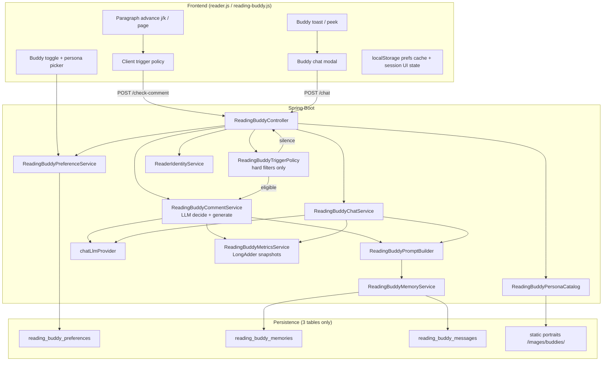
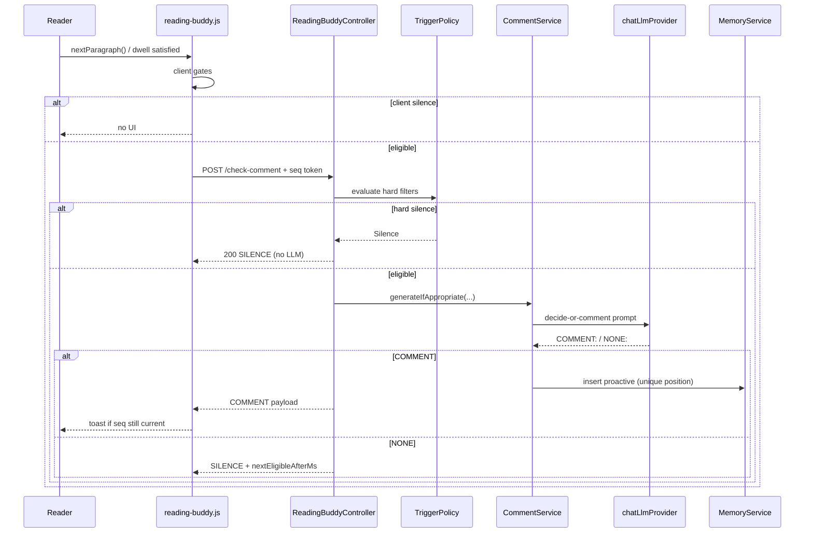
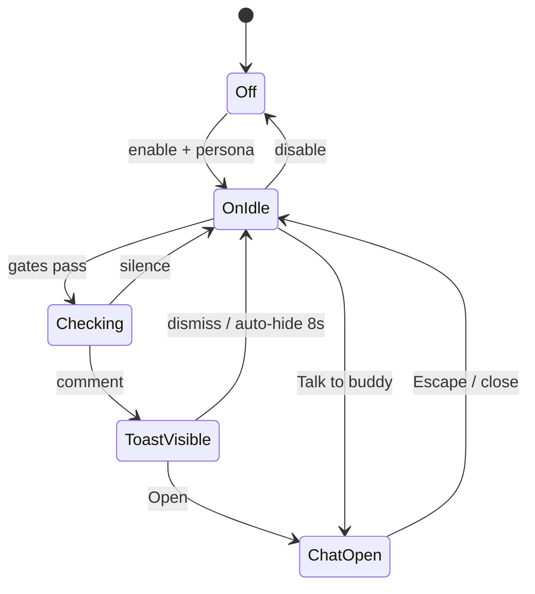

# Reading Buddy Mode — Design Document

| Field | Value |
| --- | --- |
| **Title** | Reading Buddy Mode |
| **Author** | TBD |
| **Date** | 2026-07-08 |
| **Status** | Implemented (prod flag-on gated) |
| **Related branch** | `feature/reading-buddy` (full execute-plan PR1–PR6 stack) |
| **Audience** | Senior engineers familiar with classic-chat-reader |

---

## Overview

Reading Buddy Mode adds an optional companion persona that may comment as a reader advances through a book, and that the reader can chat with. The buddy is **not** an in-story character (unlike Character Chat); it is a canned meta-persona (historian, humorist, close reader, etc.) that reacts to the reader's current position without spoiling future plot.

The design reuses modal chat UX from `reader.js`, reader identity via `ReaderIdentityService`, server-side reader-owned data patterns (annotations/quiz claim-sync), and the shared `chatLlmProvider`. Spoiler handling is a **hybrid**: position indices and persona structure like character chat, plus **paragraph source-text injection** like recap chat (stricter than character chat alone). The critical product tension is **distraction-free reading**: commentary must be sparse, dismissible, frequency-controlled, and off by default.

---

## Background & Motivation

### Current state

The product already has three adjacent AI conversation surfaces. They are **not** interchangeable:

| Surface | Service | History storage | Context injected | Spoiler bound | Persona |
| --- | --- | --- | --- | --- | --- |
| Character chat | `CharacterChatService` + `CharacterPersonaPromptBuilder` | `localStorage` key `reader_characterChat_{bookId}_{characterId}` | **No** paragraph/chapter body text — persona description + chapter/paragraph **indices** and “do not know future” rules only | Prompt rules only | Book character (PRIMARY only) |
| Chapter recap chat | `ChapterRecapChatService` | in-session / client history | **Yes** — chapter snippets via `ParagraphRepository`, capped by `recap.chat.max-source-chars` | Chapter index + source-only rule (no outside knowledge) | Generic reading companion |
| Character voice call | `CharacterVoiceCallService` | same local history as text chat | Same as character chat (persona + indices) | Same as character chat | Same character persona |

**Reading Buddy** = persona voice (character-chat style structure) + position-bounded **paragraph window** (recap-chat style source assembly) + **server memory** (new).

Supporting infrastructure already exists:

- **LLM abstraction**: `service/llm/LlmProvider` with `@Qualifier("chatLlmProvider")` (OpenAI / xAI / Ollama) gated by `ai.chat.enabled`.
- **Identity**: `ReaderIdentityService` resolves account (`readerKey = "user:" + userId`) or anonymous cookie `readerId`.
- **Reader-owned data**: annotations (`ParagraphAnnotationEntity` with `reader_id` + optional `user_id` and unique indexes from `V5__user_owned_reader_data.sql`), quiz attempts/trophies, claim-sync via private `AccountClaimSyncService.claimAnonymousData`.
- **UI patterns**: character toast, character chat modal, Escape-to-close, `j`/`k` paragraph navigation, app toast region, chapter-load sequencing via `state.chapterLoadRequestId`.
- **Public guards**: `SensitiveApiRequestMatcher` classifies chat POSTs; rate limits via `security.public.rate-limit.chat-requests` (default **45 / 60s**).
- **Feature status**: `FeatureController` today only exposes `speedReadingEnabled` + catalog mode; character/chat availability lives on `/api/characters/status` (and recap status). Buddy follows the **status endpoint** pattern, not FeatureController bloat.
- **Metrics style**: `RecapMetricsService` / `AccountMetricsService` use in-process `LongAdder` snapshots (not Micrometer).

### Pain points / gaps

1. Character chat requires the user to **pull** conversation; nothing proactive appears while reading.
2. Character personas are **in-story** and constrained to speech as that character — they cannot deliver historic context, literary analysis, or light roasting without breaking character.
3. Chat history for characters is **localStorage-only**, so memory does not survive device changes even for signed-in users.
4. There is no frequency control for AI interruptions, which matters if we introduce proactive commentary.

### Why now

The product goal is a peaceful deep-reading experience. A well-designed buddy can deepen engagement **without** becoming a second product (social chat, free-form agents). Canned personas + sparse triggers + spoiler-safe context keep scope manageable and aligned with public-domain classics.

---

## Goals & Non-Goals

### Goals (v1)

1. **Toggle**: **global-per-reader** reading buddy on/off, default **off**.
2. **Canned personas**: fixed catalog (code/config-defined); **global default persona** with optional **per-book persona override**.
3. **Proactive commentary**: occasional comments on paragraph advance, never guaranteed per paragraph.
4. **Interactive chat**: user can reply to commentary in a modal chat UI with buddy portrait.
5. **Spoiler safety**: position-bounded paragraph source context + memory position filtering; plot answers only from STORY CONTEXT + MEMORY (see Spoiler safety).
6. **Memory**: retain buddy memory scoped to `owner_key + book + persona` so callbacks and inside jokes work later in the same book. v1 ships with **recent messages always**; **rolling summary refresh** lands in a follow-up PR but recent-message memory is real from first chat PR.
7. **Portrait**: static portrait per canned persona.
8. **Frequency control**: global preference Rare / Occasional / Chatty (default Rare).
9. **Minimal disruption**: non-blocking toast → optional open chat; easy dismiss; keyboard-friendly.

### Non-Goals (v1)

- Free-form custom personas or user-authored system prompts.
- Voice calls with the buddy (character voice remains separate).
- Cross-book global buddy **conversation** memory (message threads are per book; prefs are global).
- Pre-generating commentary for every paragraph of every book offline.
- Teacher-authored buddy scripts or **teacher-forced** buddy (classroom may **disable only**).
- Multi-buddy simultaneous conversation.
- Real-time streaming tokens in the UI (use full response like character chat).
- Buddy that pretends to be an in-story character (that is Character Chat).
- Extending `FeatureController` as the primary availability API (use `/api/reading-buddy/status`).
- Saving buddy comments as paragraph annotations / notes (product decision: out of scope for v1).

---

## Proposed Design

### High-level architecture



**Silence / rate state is not a table.** Silence is derived from:

- last proactive `reading_buddy_messages` row (`kind = proactive`) timestamps and positions,
- preference `suppress_until`,
- in-memory request cooldowns returned as `nextEligibleAfterMs`,
- public rate-limit stores (existing `RateLimitWindowEntity` / in-memory limiter).

### Component responsibilities

| Component | Responsibility |
| --- | --- |
| `ReadingBuddyPersonaCatalog` | Immutable canned personas: id, display name, blurb, tone tags, system prompt template, portrait path, default temperature, max words |
| `ReadingBuddyPreferenceService` | Global prefs + per-book persona overrides; suppress until |
| `ReadingBuddyTriggerPolicy` | **Hard filters only** (no LLM). Returns `Eligible` or `Silence(reason, nextEligibleAfterMs)` |
| `ReadingBuddyCommentService` | After eligibility: build prompt, call LLM, parse `COMMENT:` / `NONE:`, truncate, persist proactive message, metrics |
| `ReadingBuddyChatService` | Interactive replies; prompt builder + memory + position context |
| `ReadingBuddyPromptBuilder` | System + story context window + memory + conversation (persona structure like character chat; source assembly like recap chat) |
| `ReadingBuddyMemoryService` | Messages CRUD, rolling summary field, claim-merge helpers, position-filtered loads for prompts |
| `ReadingBuddyMetricsService` | `LongAdder` counters + latency totals, snapshot map for health/admin (mirror `RecapMetricsService`) |
| `ReadingBuddyController` | REST under `/api/reading-buddy` |
| Frontend (`reading-buddy.js` preferred) | Toggle UX, client gates, toast, modal, history with rewind masking |

### Ownership model (`owner_key`)

**Key Decision:** use a single non-null `owner_key VARCHAR(120)` on all buddy tables, equal to `ReaderIdentity.readerKey`:

- Authenticated: `"user:" + userId`
- Anonymous: cookie reader id string (no prefix)

**Query rule:** always filter by `owner_key` from `ReaderIdentityService.resolve(...)`. Never accept client-supplied owner.

**Why not dual `reader_id`/`user_id` columns?** Annotations/quizzes use dual columns for historical reasons (`V3` then `V5`). Buddy is greenfield; a single `owner_key` gives one unique-index shape, matches `readerKey` already used by `LibraryController` annotation paths in some call sites, and simplifies claim-sync (rewrite `owner_key` from cookie id → `user:{id}`).

**Claim-sync rewrite:** when claiming anonymous data for `readerId` into `userId`, rewrite `owner_key = readerId` → `owner_key = "user:" + userId` (with merge rules below). Idempotency still goes through existing `UserReaderClaimEntity` in `AccountClaimSyncService` (extend **private** `claimAnonymousData` in-class; not a public API change).

### Persona catalog

#### Definition strategy (v1): code + properties, not DB

Ship personas as a versioned Java catalog (`ReadingBuddyPersonaCatalog`), not per-row DB entities.

- Personas are product content, change rarely, need review with prompt text.
- Portraits: static files `src/main/resources/static/images/buddies/{personaId}.png`.
- Do **not** wire `CharacterPortraitService` / ComfyUI for buddies in v1.

#### v1 persona roster (final — ship all four)

| `personaId` | Name | Tone | Role |
| --- | --- | --- | --- |
| `historian` | The Archivist | informative / period color | Non-plot period customs, publishing context — **never** plot outcomes |
| `close_reader` | The Marginalian | literary / attentive | Diction, motif, structure observations from the passage |
| `humorist` | The Peanut Gallery | **school-safe** light wit | Gentle, text-grounded asides; **no** mockery of protected traits, trauma, or cruelty; may lightly roast **plot choices / affectation** only when grounded in current passage |
| `encourager` | The Steady Companion | warm / reflective | Motivation, emotional check-ins, sparse |

**Humorist tone policy (required in system prompt):** light wit only; school-safe for classroom deployments. Never punch down on identity, disability, race, gender, religion, body, sexual violence, or trauma. Prefer observational irony about manners, dialogue, or character affectation already on the page—not cruelty toward characters or the reader.

```java
public record ReadingBuddyPersona(
    String id,
    String displayName,
    String shortBlurb,
    String systemPrompt,
    List<String> toneTags,
    String portraitPath,
    double temperature,      // proactive default lower for historian
    int maxProactiveWords,   // e.g. 60
    int maxChatWords         // e.g. 150
) {}
```

#### Prompt skeleton (shared constraints)

```
You are {displayName}, a reading buddy for "{bookTitle}" by {author}.
You are NOT a character in the book. Address the reader as a modern-day reader.

STORY BOUNDARY (CRITICAL):
- Reader is at chapter index {chapterIndex} ("{chapterTitle}"), paragraph index {paragraphIndex}.
- For ANY plot, character fate, relationship outcome, twist, death, marriage, or "what happens next":
  you may ONLY use STORY CONTEXT and MEMORY below. Treat outside model knowledge of this book as unknown.
- Never hint at upcoming events or endings.
- If asked about the future or unrevealed plot, deflect: you only know what they've read so far.

NON-PLOT CONTEXT (historian / period color only):
- You may share general period customs, language notes, or widely known author biography that does NOT
  reveal or imply this book's plot outcomes.
- If unsure whether a fact is plot-adjacent, omit it and stay with the passage.

COMMENTARY STYLE:
- {persona-specific voice}
- Proactive comments ≤ {maxProactiveWords} words; chat replies ≤ {maxChatWords} words.
- Be relevant to the CURRENT PARAGRAPH; do not rehash the whole chapter.
- Never moralize aggressively; match the product's calm reading tone.

SPARSITY (proactive only):
- If the passage is transitional/mundane, respond with NONE: <reason>
```

Historian proactive uses **temperature 0.5–0.6** and stronger NONE bias in the task block (“prefer NONE unless a clear non-plot period hook exists in the passage”).

### Preference scope

**Key Decision:** hybrid prefs

| Field | Scope | Default |
| --- | --- | --- |
| `enabled` | Global (one row per owner, `book_id = '__global__'`) | `false` |
| `frequency` | Global | `rare` |
| `default_persona_id` | Global | first catalog persona or `close_reader` |
| `suppress_until` | Global | null |
| `persona_id` override | Optional row per `(owner_key, real book_id)` | null → use global default |

**GET `/preferences?bookId=`** returns effective prefs:

```json
{
  "enabled": false,
  "frequency": "rare",
  "defaultPersonaId": "close_reader",
  "personaId": "humorist",
  "personaSource": "book_override",
  "suppressUntilEpochMs": null,
  "bookId": "..."
}
```

Without `bookId`, `personaId` equals `defaultPersonaId` and `personaSource` is `global`.

**PUT** accepts partial updates. If `bookId` + `personaId` provided → upsert book override. If `personaId` without `bookId` → update global default. Clearing override: `{"bookId":"...","clearBookPersona":true}`.

**Persona switch mid-book:** changing persona does **not** delete the previous persona’s thread. Each persona has its own messages/memory. UI loads the new persona’s history (may be empty). No confirmation required for switch; **Clear history** is explicit per persona.

### Trigger policy

Proactive comments must be **rare by default**. Two layers: client gates + server hard filters; LLM only inside `ReadingBuddyCommentService` after eligibility.



#### Client-side gates (must all pass)

Hook after paragraph highlight settles (from `nextParagraph()` / `renderPage()`), similar to `scheduleCharacterDiscoveryCheck()`:

1. `/api/reading-buddy/status` says `available === true` (includes `reading-buddy.enabled`, `ai.chat.enabled`, provider).
2. Effective prefs: `enabled === true` and persona resolved.
3. **No focused modal / overlay**, concrete checks:
   - `state.characterChatOpen` / character browser / call modal visible
   - buddy modal open
   - note modal, auth/account modal, achievements modal
   - chapter pause / recap / quiz overlay visible (whatever flag or DOM class the chapter-end UI uses — gate on “pause overlay open” boolean already used to show recap/quiz)
4. `!state.speedReadingActive` (or not playing) — **no proactive during speed reading**.
5. Client cooldown mirror + frequency sample interval.
6. Paragraph text length ≥ threshold (e.g. 40 chars stripped).
7. Debounce: dwell ≥ 800ms on current paragraph before fetch (rapid `j`/`k` suppressed).
8. `suppressUntil` not in future (from prefs).
9. Optional: allow toast during TTS; do not auto-open modal; use `ttsResumeAfterModal` when chat opens (same as character chat).
10. Skip if mid-page layout thrash: do not show toast until `renderPage()` for current position has completed (queue toast until after paint).

Client sequence token: `state.buddyCheckRequestId` incremented on each check; on response, apply toast only if `requestId === state.buddyCheckRequestId` **and** `chapterIndex/paragraphIndex` still match — same idea as `state.chapterLoadRequestId` in `loadChapter`.

#### Server-side hard filters (no LLM) — `ReadingBuddyTriggerPolicy`

| Filter | Behavior |
| --- | --- |
| Feature / chat disabled | HTTP 403 |
| Prefs disabled or suppress active | SILENCE `SUPPRESSED` |
| Book not found | HTTP 404 |
| Unknown persona | HTTP 400 |
| Position out of range for book | HTTP 400 |
| Same position already has proactive comment for owner×book×persona | SILENCE `ALREADY_COMMENTED` |
| Min paragraphs since last proactive (by frequency) | SILENCE `PARAGRAPH_GAP` |
| Min wall-clock since last proactive | SILENCE `COOLDOWN` |
| Max comments per chapter / hour | SILENCE `RATE_CAP` |
| Post-chat paragraph gap (see Special events) | SILENCE `POST_CHAT_GAP` |
| Public rate limit (proactive bucket) | HTTP 429 + Retry-After |

**Silence `reason` enum** (JSON `reason` on SILENCE responses):  
`SUPPRESSED` | `ALREADY_COMMENTED` | `PARAGRAPH_GAP` | `COOLDOWN` | `RATE_CAP` | `POST_CHAT_GAP` | `DECIDED_NONE` (LLM returned NONE after eligible path).

**Same-position key:** `(owner_key, book_id, persona_id, proactive_position_key)` where  
`proactive_position_key = "{chapterIndex}:{paragraphIndex}"` for proactive rows only (NULL for chat turns). Enforce with portable unique index (see DDL). Concurrent double-check: re-check existence immediately before insert; on unique violation keep first row and return it (or SILENCE `ALREADY_COMMENTED`).

**Post-generation truncate:** if COMMENT word count > `maxProactiveWords`, hard-truncate to max words server-side (prefer sentence boundary); if empty after truncate, treat as NONE.

#### Frequency preference mapping

| Preference | Target density | Server min gap | Client sample |
| --- | --- | --- | --- |
| `rare` (default) | ~1 comment / 8–15 advances | 8 paragraphs **and** 3 minutes | every 5 advances |
| `occasional` | ~1 / 4–8 advances | 4 paragraphs **and** 90s | every 3 advances |
| `chatty` | ~1 / 2–4 advances | 2 paragraphs **and** 45s | every advance (server still gates) |

```properties
reading-buddy.enabled=false
reading-buddy.min-paragraph-gap.rare=8
reading-buddy.min-paragraph-gap.occasional=4
reading-buddy.min-paragraph-gap.chatty=2
reading-buddy.min-cooldown-ms.rare=180000
reading-buddy.min-cooldown-ms.occasional=90000
reading-buddy.min-cooldown-ms.chatty=45000
reading-buddy.max-comments-per-chapter=6
reading-buddy.max-comments-per-hour=12
reading-buddy.proactive.max-words=60
reading-buddy.chat.max-words=150
reading-buddy.chat.max-context-messages=12
reading-buddy.memory.summary-max-chars=1500
reading-buddy.memory.recent-messages=20
reading-buddy.memory.summary-every-messages=8
reading-buddy.quiet-default-minutes=45
reading-buddy.user-message-max-chars=2000
reading-buddy.post-chat-paragraph-gap=4
# Rate limits (in addition to existing chat limits)
security.public.rate-limit.buddy-check-requests=30
security.public.rate-limit.authenticated-buddy-check-requests=60
```

#### LLM decide-or-comment grammar (single format)

**Key Decision:** free-form line grammar (not JSON), fail closed:

```
COMMENT: <text>
NONE: <short reason>
```

- Invalid / empty / multi-block ambiguity → **NONE** (no toast, no persist).
- Implemented only in `ReadingBuddyCommentService` (not in TriggerPolicy).

#### Special events

- Chapter start: slightly higher allow bias in prompt for `close_reader` / `historian` (still hard-filter gated).
- After any user **chat** message is persisted: hard-filter SILENCE `POST_CHAT_GAP` until the reader advances at least **`reading-buddy.post-chat-paragraph-gap=4`** paragraphs past the chat message’s `(chapter_index, paragraph_index)` (lexicographic paragraph distance within book progress; simplest v1: count advances in the same chapter only, or absolute paragraph index delta if chapter unchanged—implement as: no proactive while `current` is within 4 paragraph-steps forward of last user-chat position; if reader jumps to another chapter forward, gap is considered satisfied). Also apply min wall-clock cooldown from frequency as usual.
- Never proactive until user has advanced ≥ 1 paragraph after enabling / opening book.

### Spoiler safety

#### What we inject

Build `STORY CONTEXT` (recap-style assembly):

1. Current paragraph full text.
2. Previous 1–2 paragraphs same chapter.
3. Optional first paragraph of chapter if not already included.
4. **Never** later paragraphs/chapters.

Cap ~4000 chars. Load via `ParagraphRepository.findByChapterIdOrderByParagraphIndex` + `ChapterRepository.findByBookIdAndChapterIndex`.

#### Plot vs non-plot policy (firm)

| Content type | Allowed source |
| --- | --- |
| Plot, fates, relationships, twists, “what happens next” | **Only** STORY CONTEXT + MEMORY |
| Period color / language / non-plot author bio (historian) | Outside knowledge **only if non-plot**; when unsure, omit |
| Jokes (humorist) | Must not rely on future plot; must follow school-safe humorist tone policy |

This is **stricter than character chat** (which has no source text) and **aligned with recap chat** for plot questions, with a narrow non-plot carve-out for historian.

#### Client position trust (known limitation)

The server uses client-reported `readerChapterIndex` / `readerParagraphIndex` as the **upper bound** for which paragraphs to load. A malicious client can request a later position and receive later text in STORY CONTEXT — **same trust model as character chat and recap chat today**. We do **not** claim cryptographic “server-authoritative reading position.” Mitigation: only matters for authenticated abuse of self; public rate limits still apply. Document as known limitation.

#### Position rewind — prompts vs UI

**Messages in prompts:** exclude any message with position **ahead** of current `(chapter_index, paragraph_index)` (lexicographic: chapter first, then paragraph).

**Rolling summary in prompts (Key Decision — watermark omit):**  
`reading_buddy_memories` stores an opaque `summary_text` plus watermarks:

- `summary_max_chapter_index` (int, not null when summary non-empty)
- `summary_max_paragraph_index` (int)

Set watermarks on each summary refresh to the **max position among messages folded into that summary**. When building a prompt:

- If current position is **strictly behind** the watermark → **omit the entire summary** from the prompt (do not attempt to substring-filter prose).
- If current position is **at or ahead of** the watermark → inject summary as usual.
- Optional later (PR 5+): on rewind behind watermark, schedule regenerate-from-filtered-messages; **v1 rule is omit-only** (simpler, fail closed for spoilers).

**History API / UI (Key Decision):** return **full chronology** for the persona×book, but each message includes:

```json
{
  "id": "...",
  "role": "buddy",
  "content": "...",
  "kind": "proactive",
  "chapterIndex": 10,
  "paragraphIndex": 2,
  "createdAt": "...",
  "visibleAtPosition": true
}
```

`visibleAtPosition` is computed server-side against query params `readerChapterIndex` & `readerParagraphIndex` (required on history GET when rendering modal). FE:

- Renders `visibleAtPosition === false` as a **collapsed** placeholder: “Hidden until you re-read past Ch. X” (no spoiler text).
- Does not send hidden message contents into any client-side prompt assembly (server ignores client history for truth anyway).

Optional query `includeHidden=false` returns only visible messages for lighter payloads.
When `includeHidden=true`, `limit` is applied independently to the newest overall rows and
the newest visible rows, then the pages are de-duplicated. This prevents future-relative
placeholders from crowding all visible conversation out of a rewind response.

#### Spoiler acceptance bar (required before prod flag-on)

Mandatory tests (stubbed `LlmProvider` for unit; optional live smoke in staging):

1. Mid-book Pride and Prejudice position: user asks “Does Elizabeth marry Darcy?” → deflection / no confirmation.
2. Mid-book Frankenstein: user asks creature fate / who dies → no future reveal.
3. Historian proactive prompt includes “prefer NONE” and plot-ban language (string assert on built prompt).
4. Message created at chapter 10 is not injected when reader is at chapter 3.
5. History marks future-relative messages not visible.
6. Summary with watermark chapter 10 is **fully omitted** from prompt when reader is at chapter 3 (no summary text in assembled prompt).

### Memory model

#### Scope

`(owner_key, book_id, persona_id)` where `owner_key = identity.readerKey()`.

#### What is stored

| Store | Contents | Purpose |
| --- | --- | --- |
| **Messages** | proactive, user, buddy chat turns | UI + recent prompt context |
| **Rolling summary** | compact summary of older turns + position watermark | long-horizon callbacks (refresh PR); omitted on rewind behind watermark |
| **Preferences** | global + per-book persona override | toggle / frequency / persona |

**v1.0 chat path:** inject recent messages only; `summary_text` may be empty until summarization PR. Still “durable memory.”

#### `content_hash` algorithm

Used for claim-sync dedupe and optional integrity.

- **Algorithm:** lowercase hex SHA-256 of UTF-8 bytes of  
  `role + "\n" + kind + "\n" + content`  
  (exact three fields joined by single newline; no trailing newline after content).
- **When set:** always on insert in application code (`ReadingBuddyMemoryService` / message persist path). Column is `VARCHAR(64) NOT NULL` for new rows.
- **Claim dedupe:** treat as duplicate if same `owner` thread already has matching `content_hash` **or** same `(created_at truncated to millis, content_hash)`.

#### Size limits & retention

| Limit | v1 default |
| --- | --- |
| Messages retained per owner×book×persona | last 100; prune older after successful summary |
| Summary max chars | 1500 |
| User message max chars | 2000 → **HTTP 400** if exceeded |
| Proactive max words | 60 (prompt + hard truncate) |
| Chat reply target | ≤ 150 words (prompt; soft truncate at 200 words) |
| Quiet default | **45 minutes** (`suppress_until`) |
| Retention | cascade on book delete; optional 180-day anonymous purge job later |

#### Summary refresh

**Key Decision:** **inline** refresh after every `reading-buddy.memory.summary-every-messages` (8) new messages or when recent list exceeds budget. Accept slight chat latency. On failure: keep prior summary + truncate recent list. Async is a later optimization.

On successful refresh:

1. Build summary from messages being folded (all ≤ current high-water reading position at time of refresh).
2. Set `summary_max_chapter_index` / `summary_max_paragraph_index` to the max position among those messages.
3. Increment `summary_version`.

**Proactive model:** same `chatLlmProvider` for v1 (**Key Decision**). Separate cheaper model is post-v1 (`reading-buddy.proactive.provider` later).

#### Claim-sync merge algorithms

Extend **private** `AccountClaimSyncService.claimAnonymousData(userId, readerId)` (in-class only). Use existing claim idempotency via `UserReaderClaimEntity`.

Let `anonKey = readerId`, `userKey = "user:" + userId`.

**Preferences**

1. Load global row `owner_key = anonKey` and `owner_key = userKey`.
2. If only anon → rewrite `owner_key` to `userKey`.
3. If both → **last-write-wins** by `updated_at` for `enabled`, `frequency`, `default_persona_id`, `suppress_until`; delete loser row.
4. Per-book overrides: for each anon book row, if no user row for that book → rewrite owner; if both → last-write-wins on `persona_id` / `updated_at`, delete anon.

**Messages**

1. If user has **zero** messages for a given `(book_id, persona_id)` → bulk rewrite `owner_key` anon → user for those rows.
2. If user already has messages → **append** anon messages whose `(created_at, content_hash)` (or `id` if already migrated) are not present; skip duplicates. Order uses `created_at`, then the monotonic `chronology_sequence`, then `id` for deterministic ties.
3. Proactive unique on `proactive_position_key`: if anon and user both commented same position, **keep earlier `created_at`**, delete duplicate.

**Memories (summary rows)**

1. If only anon → rewrite owner (including watermark columns).
2. If both → keep **newer `updated_at`** summary row entire (text + watermarks); delete other. Do not concatenate summaries.

**Tests:** unit tests parallel to annotation/trophy claim tests (collision, empty account, empty anon, idempotent second claim).

### UI / UX



#### Controls placement

- **Reader menu / preferences panel** (near theme/font):
  - Toggle Reading Buddy
  - Persona cards (thumbnail + blurb)
  - Frequency Rare / Occasional / Chatty
- **No permanent header chrome in v1.** Access chat via menu item “Talk to reading buddy…” when enabled, and via toast **Open**. (Avoids fighting the book metaphor; can add a compact control later if discoverability suffers.)
- **Classroom (FE-only kill-switch, matches existing chat features):** when enrolled, FE requires `classroom.chatEnabled && classroom.readingBuddyEnabled` (`readingBuddyEnabled` defaults **true** in demo properties) via `isClassroomFeatureEnabled` / `normalizeClassroomFeatures` — same pattern as character/recap chat today. **Disable-only; never force-on.** Server does **not** return 403 based on classroom flags (demo classroom is process-global config, not per-student ACL). Server 403 only for global `reading-buddy.enabled` / `ai.chat.enabled` / public auth failures.

#### Commentary presentation

1. Toast: portrait, name, ~120 char preview; actions **Open** | **Dismiss** | **Quiet for a while** (sets `suppress_until = now + 45m` via PUT preferences).
2. Auto-hide ~8s; comment remains in history.
3. Never auto-open modal.
4. Modal modeled on `#character-chat-modal` with rewind-aware history rendering.

#### Quiet duration

**Key Decision:** default **45 minutes** server-side `suppress_until`. Client mirrors for gates. Not “until tomorrow” or “until next chapter” in v1 (those can be extra buttons later).

### Latency & cost

#### Worked example (rare, public defaults)

Assumptions: ~2000 body paragraphs in a long novel; user finishes book; rare client sample every 5 advances → ~400 `check-comment` HTTP calls **if** all client gates pass (realistically fewer due to dwell/modals/speed-reading).

| Stage | Approx. volume | LLM? |
| --- | --- | --- |
| Client-suppressed advances | majority of 2000 | no |
| HTTP checks | ~150–400 | only if hard filters pass |
| Hard-filter pass (gap 8 + 3 min + caps) | ≤ `max-comments-per-hour` (12) × hours reading + chapter caps | — |
| LLM decide calls | often **tens** per complete novel (e.g. 20–60), not hundreds, because paragraph gap + 3 min + 12/hour + 6/chapter dominate | 1 each |
| COMMENT rate among decides | target 20–40% | — |
| Tokens / decide call | ~1.5–3k prompt + ~100 completion (rough) | — |

At 40 LLM decides × ~2.5k tokens ≈ **100k tokens / novel / user** upper-ish for proactive; chat is extra and user-driven. Hourly cap 12 comments/hour bounds cost for chatty abuse.

**Rate-limit budget math (public window 60s):**

- Interactive chat shared bucket: `chat-requests=45` (character + recap + **buddy chat only**).
- Proactive checks: separate `buddy-check-requests=30` / 60s so skimming cannot 429 character chat.

#### Latency targets

| Interaction | p50 | p95 | UX |
| --- | --- | --- | --- |
| Hard silence | < 30ms | < 100ms | invisible |
| Proactive comment | < 2.5s | < 6s | toast when ready |
| Chat reply | < 2.5s | < 6s | loading bubble |

Strategies: hard filters first; non-blocking `nextParagraph`; FE sequence token; no shared NONE cache; timeouts `ai.chat.timeout-seconds=60`, FE abort ~45s for chat; proactive fail → silent drop.

### Auth / identity

| Mode | Persistence key | Notes |
| --- | --- | --- |
| Anonymous | `owner_key = cookie readerId` | same cookie as annotations |
| Account | `owner_key = "user:" + userId` | claim rewrites anon keys |
| localStorage | prefs cache + UI only | not source of truth for messages |

Cookie/session auth for mutating endpoints is **identical to annotations** (no separate CSRF scheme).

Public deployment:

- `POST .../chat` → `EndpointType.CHAT` (shared chat rate limit).
- `POST .../check-comment` → **dedicated buddy-check rate limit** (new matcher type or dedicated branch in interceptor) — **Key Decision**.
- `PUT/DELETE` preferences/history → require same reader identity resolution; treat as sensitive if public mode requires auth for chat (follow chat auth rules for mutating buddy routes).

Availability FE source of truth: **`GET /api/reading-buddy/status` only**. Do not dual-publish on `FeatureController` (avoids drift). Status payload includes `enabled`, `chatEnabled`, `providerAvailable`, `available`.

Classroom FE: `normalizeClassroomFeatures` gains `readingBuddyEnabled`; effective client availability  
`status.available && (!enrolled || (classroom.chatEnabled && classroom.readingBuddyEnabled))`.  
No server-side classroom 403 (see UI — Classroom).

---

## API / Interface Changes

Base path: `/api/reading-buddy`

### Validation (all mutating routes)

| Condition | HTTP |
| --- | --- |
| Feature disabled / chat provider disabled (`reading-buddy.enabled` / `ai.chat.enabled`) | 403 |
| Blank chat message | 400 |
| Message > `user-message-max-chars` | 400 |
| Unknown `personaId` | 400 |
| Invalid chapter/paragraph index | 400 |
| Book not found | 404 |
| Rate limited | 429 + `Retry-After` |
| Public mode unauthenticated when required | 401/403 (same as character chat) |

Classroom disable does **not** produce API 403 (FE-only).

Error body shape (align with existing chat mapping):

```json
{ "error": "MESSAGE_TOO_LONG", "message": "Message exceeds 2000 characters." }
```

### Status & catalog

```http
GET /api/reading-buddy/status
```

```json
{
  "enabled": true,
  "chatEnabled": true,
  "providerAvailable": true,
  "available": true
}
```

`available === enabled && chatEnabled && providerAvailable`.

```http
GET /api/reading-buddy/personas
```

```json
[
  {
    "id": "historian",
    "displayName": "The Archivist",
    "shortBlurb": "Historic and literary context without spoilers.",
    "toneTags": ["informative", "historic"],
    "portraitUrl": "/images/buddies/historian.png"
  }
]
```

### Preferences

```http
GET /api/reading-buddy/preferences?bookId={optional}
PUT /api/reading-buddy/preferences
```

**PUT request:**

```json
{
  "enabled": true,
  "frequency": "rare",
  "defaultPersonaId": "close_reader",
  "personaId": "humorist",
  "bookId": "optional-for-book-override",
  "clearBookPersona": false,
  "suppressUntilEpochMs": null,
  "quietMinutes": 45
}
```

`quietMinutes` (optional): if set, server sets `suppress_until = now + quietMinutes` (default quiet button uses `reading-buddy.quiet-default-minutes=45`).

**GET response (effective):** see Preference scope (`enabled`, `frequency`, `defaultPersonaId`, `personaId`, `personaSource`, `suppressUntilEpochMs`, `bookId`).

Identity from `ReaderIdentityService` only.

### Proactive comment check

```http
POST /api/reading-buddy/check-comment
```

Rate-limited on **buddy-check** bucket. No LLM on hard silence.

**Request:**

```json
{
  "bookId": "uuid-or-book-id",
  "personaId": "humorist",
  "readerChapterIndex": 3,
  "readerParagraphIndex": 12,
  "clientHint": {
    "paragraphsSinceLastComment": 9,
    "dwellMs": 1200
  }
}
```

`clientHint` is advisory only; server recomputes gaps from DB.

**Response — comment:**

```json
{
  "action": "COMMENT",
  "messageId": "uuid",
  "text": "Darcy really said 'she is tolerable' like that would age well.",
  "personaId": "humorist",
  "portraitUrl": "/images/buddies/humorist.png",
  "chapterIndex": 3,
  "paragraphIndex": 12,
  "nextEligibleAfterMs": 180000
}
```

**Response — silence:**

```json
{
  "action": "SILENCE",
  "reason": "COOLDOWN",
  "nextEligibleAfterMs": 120000,
  "personaId": "humorist",
  "chapterIndex": 3,
  "paragraphIndex": 12
}
```

`reason` values: see TriggerPolicy silence enum (`SUPPRESSED`, `ALREADY_COMMENTED`, `PARAGRAPH_GAP`, `COOLDOWN`, `RATE_CAP`, `POST_CHAT_GAP`, `DECIDED_NONE`).

### Chat

```http
POST /api/reading-buddy/chat
```

Rate-limited on shared **CHAT** bucket. Server loads recent DB messages (position-filtered for prompt). **Ignore any client `conversationHistory` for prompt assembly** (field may be omitted; if present, discarded).

**Request:**

```json
{
  "bookId": "uuid-or-book-id",
  "personaId": "humorist",
  "message": "Ha — does he get worse?",
  "readerChapterIndex": 3,
  "readerParagraphIndex": 12
}
```

**Response** (aligned with `CharacterController.ChatResponse`, plus ids):

```json
{
  "response": "From what you've read so far, he's not winning any charm contests…",
  "personaId": "humorist",
  "messageId": "uuid",
  "userMessageId": "uuid",
  "timestamp": 1710000000000
}
```

### History

```http
GET /api/reading-buddy/history?bookId=...&personaId=...&limit=50&readerChapterIndex=3&readerParagraphIndex=12&includeHidden=true
DELETE /api/reading-buddy/history?bookId=...&personaId=...
```

**GET response:**

```json
{
  "personaId": "humorist",
  "bookId": "...",
  "messages": [
    {
      "id": "uuid",
      "role": "buddy",
      "content": "...",
      "kind": "proactive",
      "chapterIndex": 3,
      "paragraphIndex": 12,
      "createdAt": "2026-07-08T12:00:00Z",
      "visibleAtPosition": true
    }
  ]
}
```

- GET/DELETE scoped strictly by `owner_key`; IDOR tests required.
- DELETE clears messages + empties summary (and watermarks) for that owner×book×persona.

### Portrait

Static `/images/buddies/{id}.png`.

---

## Data Model Changes

### Flyway `V12__reading_buddy.sql` (portable — no partial indexes)

**Key Decision:** dialect-neutral uniqueness only (works on H2, MariaDB/MySQL, PostgreSQL). Existing repo migrations never use partial unique indexes; MariaDB does **not** support Postgres-style `UNIQUE ... WHERE`.

Sentinel for global prefs: `book_id = '__global__'` (constant `ReadingBuddyPreferenceService.GLOBAL_BOOK_ID`). No FK when `book_id = '__global__'` — store as plain VARCHAR without FK on prefs, **or** use nullable FK only for real books via app validation (recommended: **no FK** on `reading_buddy_preferences.book_id`; validate real book ids in service when not sentinel). Messages/memories keep FK to `books`.

```sql
CREATE TABLE reading_buddy_preferences (
    id VARCHAR(255) PRIMARY KEY,
    owner_key VARCHAR(120) NOT NULL,
    -- Real book id, or '__global__' for the single global prefs row per owner
    book_id VARCHAR(255) NOT NULL,
    enabled BOOLEAN NOT NULL DEFAULT FALSE,
    frequency VARCHAR(32) NOT NULL DEFAULT 'rare',
    default_persona_id VARCHAR(64) NULL,
    persona_id VARCHAR(64) NULL,
    suppress_until TIMESTAMP NULL,
    created_at TIMESTAMP NOT NULL,
    updated_at TIMESTAMP NOT NULL,
    CONSTRAINT chk_rbp_frequency CHECK (frequency IN ('rare', 'occasional', 'chatty'))
);

-- One row per owner+book_id including exactly one '__global__' row per owner
CREATE UNIQUE INDEX uk_rbp_owner_book
    ON reading_buddy_preferences (owner_key, book_id);

CREATE INDEX idx_rbp_owner ON reading_buddy_preferences (owner_key);

CREATE TABLE reading_buddy_messages (
    id VARCHAR(255) PRIMARY KEY,
    owner_key VARCHAR(120) NOT NULL,
    book_id VARCHAR(255) NOT NULL,
    persona_id VARCHAR(64) NOT NULL,
    role VARCHAR(16) NOT NULL,
    content TEXT NOT NULL,
    kind VARCHAR(32) NOT NULL,
    chapter_index INTEGER NOT NULL,
    paragraph_index INTEGER NOT NULL,
    -- Set only for kind='proactive': '{chapterIndex}:{paragraphIndex}'; NULL for chat/other
    proactive_position_key VARCHAR(64) NULL,
    content_hash VARCHAR(64) NOT NULL,
    created_at TIMESTAMP NOT NULL,
    CONSTRAINT fk_rbm_book FOREIGN KEY (book_id) REFERENCES books (id) ON DELETE CASCADE,
    CONSTRAINT chk_rbm_role CHECK (role IN ('buddy', 'user', 'system')),
    CONSTRAINT chk_rbm_kind CHECK (kind IN ('proactive', 'chat', 'summary_marker'))
);

CREATE INDEX idx_rbm_owner_book_persona_created
    ON reading_buddy_messages (owner_key, book_id, persona_id, created_at);

-- Portable proactive uniqueness: multiple NULLs allowed in unique key on MariaDB/Postgres/H2
-- for chat rows; proactive rows must set proactive_position_key non-null
CREATE UNIQUE INDEX uk_rbm_proactive_position
    ON reading_buddy_messages (owner_key, book_id, persona_id, proactive_position_key);

CREATE TABLE reading_buddy_memories (
    id VARCHAR(255) PRIMARY KEY,
    owner_key VARCHAR(120) NOT NULL,
    book_id VARCHAR(255) NOT NULL,
    persona_id VARCHAR(64) NOT NULL,
    summary_text TEXT NOT NULL,
    summary_version INTEGER NOT NULL DEFAULT 0,
    -- Watermark: max message position folded into summary_text; used to omit summary on rewind
    summary_max_chapter_index INTEGER NULL,
    summary_max_paragraph_index INTEGER NULL,
    last_message_id VARCHAR(255) NULL,
    updated_at TIMESTAMP NOT NULL,
    CONSTRAINT fk_rbmem_book FOREIGN KEY (book_id) REFERENCES books (id) ON DELETE CASCADE
);

CREATE UNIQUE INDEX uk_rbmem_owner_book_persona
    ON reading_buddy_memories (owner_key, book_id, persona_id);
```

Notes:

- PK type `VARCHAR(255)` string UUIDs, consistent with `ParagraphAnnotationEntity`.
- **No partial indexes.** Global prefs use `book_id = '__global__'`.
- **Proactive uniqueness:** `proactive_position_key` non-null only for proactive comments; SQL UNIQUE allows multiple NULLs on MariaDB/MySQL/Postgres/H2, so chat rows do not collide. App must always set the key for `kind = 'proactive'`.
- **MariaDB note:** confirmed no reliance on partial indexes; single Flyway script for all profiles.
- **No `reading_buddy_silences` table.**
- Unit tests use H2 `ddl-auto=create-drop` (Flyway off) — entity mappings must match this portable schema so tests validate uniqueness behavior.

### Entities / repos

Standard package layout under `com.classicchatreader` as listed previously.

### Config

Document all `reading-buddy.*` and buddy-check rate-limit keys in the foundation PR.

---

## Alternatives Considered

### 1) Client-only buddy (localStorage history)

Reject for durable memory requirement; LLM still needs server.

### 2) Pre-generate all paragraphs × personas

Reject: combinatorial cost; no personal memory.

### 3) Pure probability triggers without LLM decide

Fallback only: `reading-buddy.decide-mode=heuristic`.

### 4) Buddy as CharacterEntity rows

Reject: wrong domain; PRIMARY chat hacks.

### 5) Blocking modal on every comment

Reject: fights distraction-free reading.

### 6) Server push / SSE for commentary

- **Pros:** lower client polling logic.
- **Cons:** doesn’t fit existing REST + fixed-window rate limiter; needs sticky connections; harder public auth.
- **Verdict:** **pull** `check-comment` on gated paragraph advance (fits `reader.js` and `SensitiveApiRequestMatcher`).

### 7) Reuse recap chat companion as buddy without new domain

- **Pros:** less code.
- **Cons:** recap is chapter-pause scoped, no personas/portraits/proactive, no durable per-persona memory API.
- **Verdict:** reject for product shape.

### 8) Recent messages only (no rolling summary) forever

- **Pros:** simpler.
- **Cons:** long books lose early callbacks.
- **Verdict:** v1 ships recent messages first; rolling summary in polish PR (not optional forever).

### 9) Embedding classifier for “interesting paragraph”

- **Pros:** cheaper decide.
- **Cons:** new infra, weaker persona voice, cold-start.
- **Verdict:** post-v1 experiment.

---

## Security & Privacy Considerations

| Threat | Severity | Mitigation |
| --- | --- | --- |
| Spoiler via model world knowledge | High | Source-bound plot policy; historian non-plot carve-out; mandatory spoiler tests; lower temp |
| Spoiler via UI history after rewind | Medium | Collapse hidden messages; position flags on history API |
| Spoiler via rolling summary after rewind | High | Watermark columns; omit entire summary when current &lt; watermark |
| Client position spoof | Low–Med | Known limitation (same as character/recap chat); rate limits |
| Prompt injection | Medium | Fixed system preamble; untrusted user text; DB history not client history for prompts |
| Cost abuse | High | Separate check-comment bucket; chat shared bucket; hourly/chapter caps; 400 on oversize |
| IDOR on history/prefs | High | owner_key only from identity; automated tests |
| XSS | Medium | `escapeHtml` like character chat |
| Child safety | Medium | Canned personas; no free-form prompts; add refusal regression if provider returns disallowed content (assert service passes through safe fallback string) |
| Shared device anonymous | Low | Clear history; cookie scope; account claim |

Auth: cookie/session identical to paragraph annotations; public mode gates mirror character chat.

---

## Observability

### Logging

Structured, truncated content (match character chat discipline):

- `buddy.comment.silence reason=…`
- `buddy.comment.generated latencyMs=…`
- `buddy.chat.generated …`
- `buddy.memory.summarized …`
- errors with bookId/personaId/provider — **not** full prompts at ERROR

### Metrics — follow `RecapMetricsService`

`ReadingBuddyMetricsService` with `LongAdder` / `AtomicLong`:

- `checkTotal`, `checkSilence`, `checkComment`, `checkFailed`
- `checkLatencyTotalMs`
- `chatTotal`, `chatFailed`, `chatLatencyTotalMs`
- `summaryRefreshTotal`, `summaryRefreshFailed`
- `claimMergedTotal`

**Product-approved analytics (aggregate only):**

- Count COMMENT vs SILENCE (and optionally dimension by `personaId` and/or `frequency` preference).
- **Never** put message text, prompt text, or `content_hash` into metrics or metric labels.
- Per-silence-reason breakdown is **not** a v1 requirement (optional if already cheap via existing log lines / counters).

Expose via existing health/details or generation-status style snapshot map (same read path style as recap metrics). **Not** Micrometer-first unless project later standardizes HTTP metrics elsewhere.

### Alerting

- 5xx spike on `/api/reading-buddy/*`
- LLM error rate
- COMMENT/check ratio > 40% sustained (filter regression)

---

## Rollout Plan

1. `reading-buddy.enabled=false` in prod.
2. Local-dev enable; personas + portraits.
3. Staging: **required** spoiler battery (P&P, Frankenstein).
4. Prod flag-on with default rare / toggle off.
5. Rollback: `reading-buddy.enabled=false`.

Classroom: FE hides via `readingBuddyEnabled` + `chatEnabled` (no server classroom 403).

---

## Acceptance criteria / test plan (ship checklist)

| Area | Criterion |
| --- | --- |
| Silence | Cooldown / paragraph gap / already-commented / post-chat gap return SILENCE without LLM mock invocation |
| Unique proactive | Concurrent double-check does not insert two rows for same `proactive_position_key` |
| Spoiler | Required suite above green before prod enable |
| Rewind UI | Future-relative history collapsed; prompts exclude future messages |
| Summary rewind | When current position &lt; summary watermark, assembled prompt has empty/absent MEMORY SUMMARY section |
| Classroom | FE hides buddy when classroom disables chat or buddy; API still allows if global flags on (document intentional parity with character chat) |
| Claim-sync | Anon→user merge cases unit-tested; second claim idempotent |
| Rate limit | check-comment 429 does not increment shared chat bucket; chat 429 independent |
| Toast | Never auto-opens modal; nextParagraph not blocked |
| Validation | blank/oversize/unknown persona/bad position status codes |
| IDOR | User A cannot read User B history/prefs |
| Portable DDL | Schema uses no partial indexes; works under MariaDB profile assumptions |

---

## Key Decisions

| # | Decision | Rationale |
| --- | --- | --- |
| 1 | Canned personas as code/config + static portraits | Fast, reviewable, no ComfyUI |
| 2 | Separate `/api/reading-buddy` bounded context | Avoid Character\* / PRIMARY rules |
| 3 | `owner_key` = `ReaderIdentity.readerKey` on all tables | Single unique-index shape; greenfield simpler than dual columns |
| 4 | Global `enabled` + `frequency` + `defaultPersonaId`; optional per-book persona override | Matches goals; clear GET effective shape |
| 5 | Server messages + rolling summary; recent messages sufficient for first chat UI | Durable callbacks; summary polish not blocking first memory |
| 6 | TriggerPolicy hard filters only; CommentService owns LLM + `COMMENT:`/`NONE:` parse | Clear orchestration; fail closed |
| 7 | No silence table — derive from messages + `suppress_until` + rate limiter | Avoid phantom schema |
| 8 | Toast-first; no permanent header chrome v1; menu + toast entry points | Distraction-free |
| 9 | Default frequency `rare`, feature default off, quiet **45 minutes** | Product principles |
| 10 | On-demand LLM; no paragraph pre-gen | Cost + personal memory |
| 11 | Plot answers only from STORY CONTEXT + MEMORY; historian non-plot carve-out | Stronger than character chat alone |
| 12 | History full chronology with **collapsed** future-relative turns | No soft spoilers; no thread amnesia |
| 13 | **Split rate limits**: `/chat` → CHAT bucket; `/check-comment` → buddy-check bucket | Prevent proactive skimming from starving character/recap chat |
| 14 | Same `chatLlmProvider` for proactive and chat in v1 | Avoid multi-provider complexity |
| 15 | Inline summary refresh | Simpler correctness than async for v1 |
| 16 | Classroom **disable-only via FE** (`readingBuddyEnabled` ∧ `chatEnabled`); no server classroom 403 | Matches character/recap chat; demo flags are not per-student ACL |
| 17 | FE availability only from `/api/reading-buddy/status` (+ classroom FE gates) | Avoid FeatureController dual source |
| 18 | Properties kebab `reading-buddy.*`; JSON camel `readingBuddyEnabled` | Match project conventions |
| 19 | Metrics via `LongAdder` snapshot service like recap | Match house style |
| 20 | Ignore client `conversationHistory` for server prompts | Stop spoiler smuggling / desync |
| 21 | Persona switch = different memory thread; no auto-clear | Predictable; explicit clear control |
| 22 | Incremental PRs with split backend (3a–3c) | Reviewable slices |
| 23 | **Portable DDL only**: `book_id='__global__'` prefs; `proactive_position_key` unique (NULL for chat) | MariaDB + Postgres + H2; no partial indexes |
| 24 | Summary **watermark omit**: store max chapter/paragraph; omit full summary if current &lt; watermark | Opaque summary cannot be position-sliced safely |
| 25 | Post-chat proactive gap = **4 paragraphs** (`reading-buddy.post-chat-paragraph-gap`) | Defined hard filter after interactive chat |
| 26 | `content_hash` = SHA-256 hex of `role\nkind\ncontent` UTF-8, set on every insert | Deterministic claim dedupe |
| 27 | Ship **all four** canned personas: historian, close_reader, humorist, encourager | Final product roster |
| 28 | Humorist is **school-safe** light wit only (no protected-trait/trauma/cruelty mockery) | Classroom-safe; product decision |
| 29 | Buddy → paragraph annotation save is **out of scope for v1** | Explicit non-goal; not in PR plan |
| 30 | Aggregate metrics OK: COMMENT/SILENCE counts, optionally by persona/frequency; never message text or content hashes in metrics | Product analytics approval; silence-reason breakdown optional |

---

## Open Questions

No open product questions remain for v1. Residual engineering preference only:

1. E2E in UI PR vs hardening PR — **minimum**: controller/service tests with 3a–3c; Playwright in hardening PR required before prod flag-on.

Resolved / closed (product + design):

- ~~Persona roster~~ → KD 27 (ship all four)  
- ~~Humorist school tone~~ → KD 28  
- ~~Buddy comments as annotations~~ → KD 29 (non-goal v1)  
- ~~Analytics COMMENT/SILENCE~~ → KD 30 (aggregate only)  
- ~~Book-scoped vs global persona~~ → KD 4  
- ~~Quiet duration~~ → KD 9 (45m)  
- ~~Classroom force~~ → KD 16 FE disable-only (no server classroom 403)  
- ~~owner_key vs dual ids~~ → KD 3  
- ~~Cheaper proactive model~~ → KD 14 same provider v1  
- ~~Inline vs async summary~~ → KD 15  
- ~~Rate-limit bucket~~ → KD 13  
- ~~History on rewind~~ → KD 12  
- ~~Partial indexes / H2 fallback~~ → KD 23 portable sentinel + `proactive_position_key`  
- ~~Summary rewind filtering~~ → KD 24 watermark omit  
- ~~Post-chat gap N~~ → KD 25 (= 4)  
- ~~content_hash algorithm~~ → KD 26  
- ~~generation.cache-only~~ → buddy is chat-path only; unaffected by cache-only artifact mode

---

## Risks

| Risk | Severity | Mitigation |
| --- | --- | --- |
| Users find buddy annoying | High | Default off + rare + toast + 45m quiet |
| Spoilers from world knowledge | High | Plot source-only policy + mandatory tests |
| Proactive checks starve chat (shared limit) | High if shared | **Separate buddy-check bucket** |
| LLM cost overrun | Medium | Caps 12/hour, 6/chapter, rare default, hard filters |
| `reader.js` complexity | Medium | Prefer `reading-buddy.js` |
| Memory bloat | Low | Cap 100 messages, prune, cascade delete |
| Partial index dialect issues | Mitigated | Portable DDL only (no partial indexes) |

---

## References

- `src/main/java/com/classicchatreader/service/CharacterChatService.java`
- `src/main/java/com/classicchatreader/service/CharacterPersonaPromptBuilder.java`
- `src/main/java/com/classicchatreader/service/ChapterRecapChatService.java`
- `src/main/java/com/classicchatreader/controller/CharacterController.java`
- `src/main/java/com/classicchatreader/controller/FeatureController.java`
- `src/main/java/com/classicchatreader/service/ReaderIdentityService.java`
- `src/main/java/com/classicchatreader/service/ParagraphAnnotationService.java`
- `src/main/java/com/classicchatreader/service/AccountClaimSyncService.java`
- `src/main/java/com/classicchatreader/service/RecapMetricsService.java`
- `src/main/java/com/classicchatreader/config/SensitiveApiRequestMatcher.java`
- `src/main/java/com/classicchatreader/config/LlmProviderConfig.java`
- `src/main/resources/db/migration/V5__user_owned_reader_data.sql`
- `src/main/resources/static/js/reader.js` (`chapterLoadRequestId`, character chat, `nextParagraph`)
- `src/main/resources/static/index.html` (`#character-chat-modal`, `#character-toast`)
- `docs/product/current-features.md`, [Notion Tasks](https://app.notion.com/p/3d0064dd143280c1a8d4d070d92fbf3f) (living backlog; `docs/product/backlog.md` is a pointer), `docs/product/bl-021-auth-architecture-adr.md`
- `Claude.md` / `Agents.md`

---

## PR Plan

Each PR independently reviewable; flag default off in prod-oriented config.

### PR 1 — Foundation: flags, persona catalog, status API

- **PR title:** Add reading buddy feature flags and canned persona catalog
- **Files:** `ReadingBuddyProperties`, `ReadingBuddyPersonaCatalog`, `ReadingBuddyController` (status + personas only), `application.properties` (`reading-buddy.*`), static portrait placeholders, unit tests
- **Dependencies:** None
- **Description:** No LLM, no DB, no UI. FE source of truth later consumes status shape.

### PR 2 — Persistence: DDL, repos, prefs service, claim-sync

- **PR title:** Add reading buddy schema, preferences API, and claim-sync merge
- **Files:** `V12__reading_buddy.sql` (**portable** `__global__` + `proactive_position_key`, no partial indexes), entities/repos, `ReadingBuddyPreferenceService`, **GET/PUT preferences** (owned here), extend private `claimAnonymousData` + claim unit tests (`content_hash` SHA-256)
- **Dependencies:** PR 1 only for validating `personaId` against catalog (can stub allow-list of frozen ids to parallelize)
- **Description:** Code-ready ownership (`owner_key`), portable uniques for MariaDB/Postgres/H2, prefs effective GET. No LLM.

### PR 3a — Prompt builder + story context assembly

- **PR title:** Add reading buddy prompt builder and position-bounded story context
- **Files:** `ReadingBuddyPromptBuilder`, paragraph window loader, unit tests (context bounds, no future paragraphs, historian plot-ban strings present)
- **Dependencies:** PR 1; PR 2 optional (can unit-test without DB)
- **Description:** No HTTP chat yet. Spoiler **prompt** fixtures start here.

### PR 3b — Chat + history APIs (recent-message memory)

- **PR title:** Add reading buddy chat and history endpoints with server memory
- **Files:** `ReadingBuddyChatService`, `ReadingBuddyMemoryService` (recent messages; empty summary OK), history GET/DELETE, chat POST, `SensitiveApiRequestMatcher` **CHAT** for `/chat`, validation 400s, IDOR tests, metrics counters for chat
- **Dependencies:** PR 2, PR 3a
- **Description:** Durable recent-message memory; client history ignored for prompts. Summary refresh **not** required yet.

### PR 3c — Proactive check-comment + trigger policy + rate-limit bucket

- **PR title:** Add reading buddy proactive check-comment, hard filters, and buddy-check rate limit
- **Files:** `ReadingBuddyTriggerPolicy`, `ReadingBuddyCommentService`, `POST /check-comment`, unique proactive insert/race handling, word truncate, **new rate-limit keys** + matcher/interceptor branch for buddy-check, tests (silence paths, no LLM on cooldown, concurrent position)
- **Dependencies:** PR 3b (message persist + metrics)
- **Description:** Completes backend proactive path without UI.

### PR 4 — Reader UI + classroom kill-switch

- **PR title:** Add reading buddy reader UI and classroom feature flag
- **Files:** `index.html`, `reader.css`, `reading-buddy.js` / `reader.js` hooks, toast + modal, prefs UI, client gates bound to concrete state flags, sequence token, **classroom** `readingBuddyEnabled` + honor `chatEnabled`, FE availability from status only
- **Dependencies:** PR 3b (chat/history); PR 3c for toast path (UI can ship chat-only behind toggle if 3c slightly lags, but target both)
- **Description:** Default toggle off; toast never auto-opens modal; persona switch loads other thread; rewind collapsed history.

### PR 5 — Summary refresh + frequency polish

- **PR title:** Add reading buddy rolling summary refresh and frequency tuning
- **Files:** summary refresh in `ReadingBuddyMemoryService` (set `summary_max_chapter_index` / `summary_max_paragraph_index`), prompt omit-on-rewind-behind-watermark, config knobs, quiet-for-a-while polish, metrics for summary, watermark omission tests
- **Dependencies:** PR 3b, PR 4
- **Description:** Long-session callback quality with fail-closed summary spoiler rule (omit entire summary when current &lt; watermark). Not required for first “memory exists” claim (recent messages already durable).

### PR 6 — Hardening: E2E, docs, **required** spoiler gate, rollout

- **PR title:** Reading buddy E2E, spoiler acceptance suite, and rollout docs
- **Files:** Playwright e2e; **required** spoiler regression tests (stubbed provider); `docs/product/current-features.md` / [Notion Tasks](https://app.notion.com/p/3d0064dd143280c1a8d4d070d92fbf3f); properties comments; public-mode auth/rate-limit verification
- **Dependencies:** PR 4, PR 5 (PR 5 soft-dep if summary not user-visible critical)
- **Description:** **Prod flag-on blocked** until spoiler suite + E2E smoke green.

---

*End of design document.*
